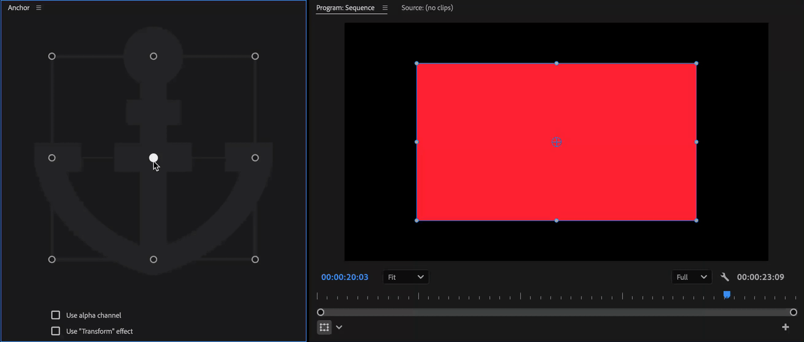
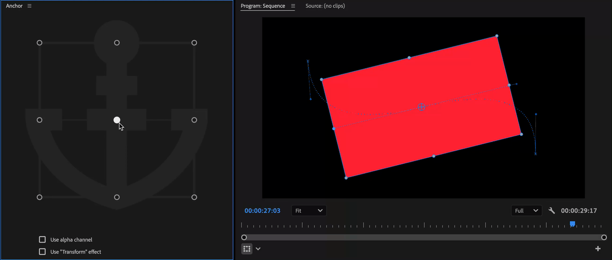
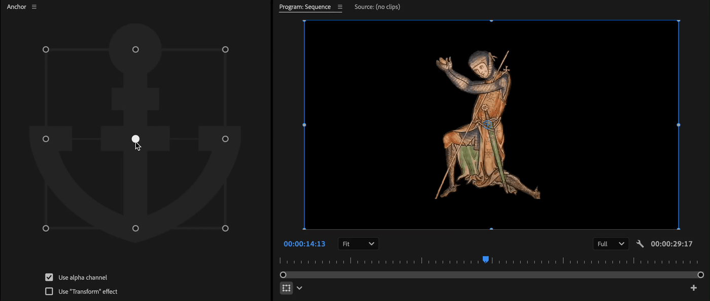
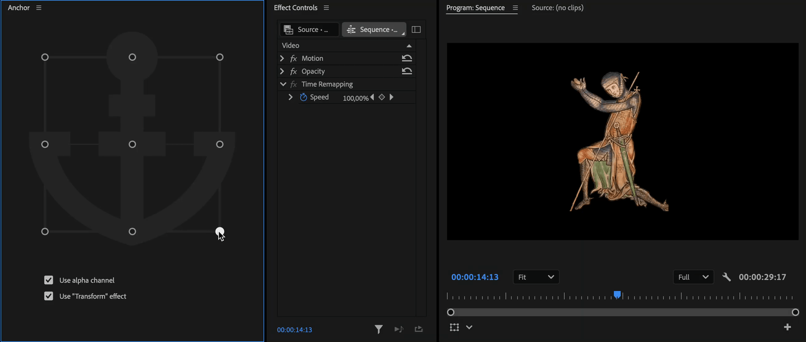

# Main panel

Select one or more clips and click on one of 9 positions in Anchor panel.

<figure><figcaption></figcaption></figure>

Anchor will keep original animation of a clip.

<figure><figcaption></figcaption></figure>

## Use alpha channel

Enable it, to use clip's alpha channel for anchor position.

<figure><figcaption></figcaption></figure>

## Use "Transform" effect

Enable it, to move an anchor point of Transform effect, instead of Motion effect.

If there is no Transfrom effect on a selected clip, it will be applied and then an anchor point will be repositioned.

<figure><figcaption></figcaption></figure>


Anchor always moves an anchor point of Motion effect for standard clips or Vector Motion effect for graphics clips.

