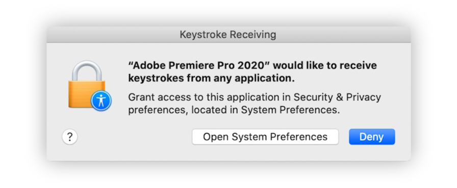
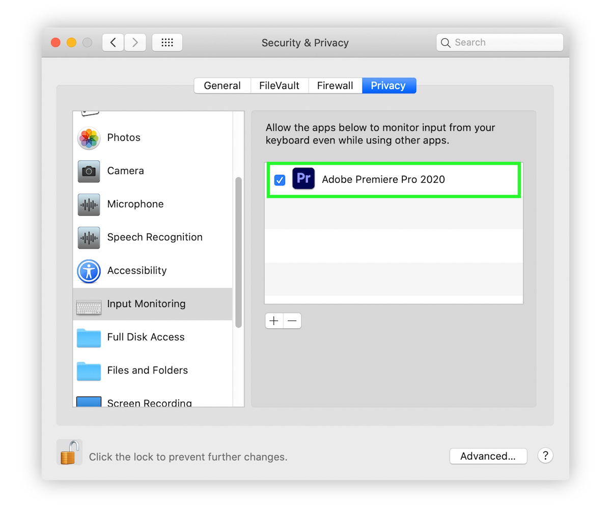

# macOS Permissions

To allow Arrow work properly, one need to give Input Monitoring permissions for Premiere Pro.

Normaly, after Arrow installation, when opening Premiere Pro, it should prompt user with dialog:

If you don’t have these pop-up, you can grant permissions manually. Go to:  
**System Preferences &gt; Security & Privacy &gt; Privacy.**  
Go to each section, hit “+", find your Premiere Pro version, add it, make sure it has a tick mark.

## Input monitoring \(Catalina and above\)

## Reset permissions

Sometimes macOS doesn't have permissions right, to reset them do this:

* give permission to Premiere Pro \(input monitoring\), skip if permission already granted
* untick Premiere Pro in permissions
* restart computer
* tick Premiere Pro back in permissions
* launch Premiere Pro and test

