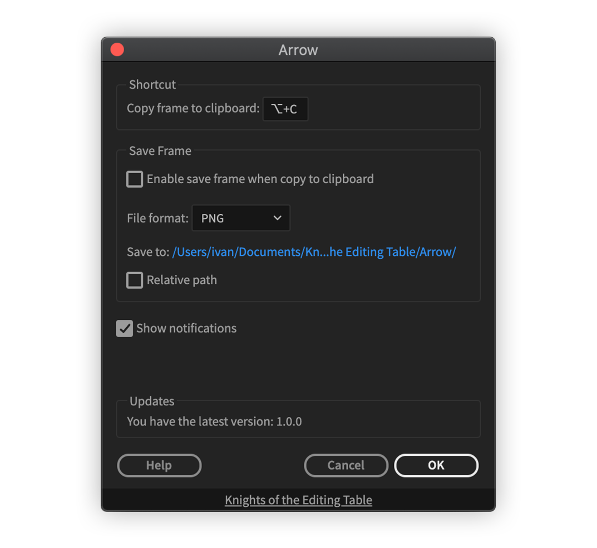

# How it works

Arrow works in background, when one presses a user defined shortcut Arrow will copy a frame at playhead to clipboard.


Arrow listens for a shortcut press with help of [Spellbook](../spell-book/)\
(Excalibur relies on it as well)


## Settings

### Shortcut

Here one can assign a shortcut (by default it is not set) to "copy frame" command.


If a shortcut can't be assigned, please read compatibility guide.


### Save Frame

It is possible to save copied frame in following formats:

* PNG
* JPEG
* TIFF
* Targa
* DPX

Output folder can use absolute or relative path.
