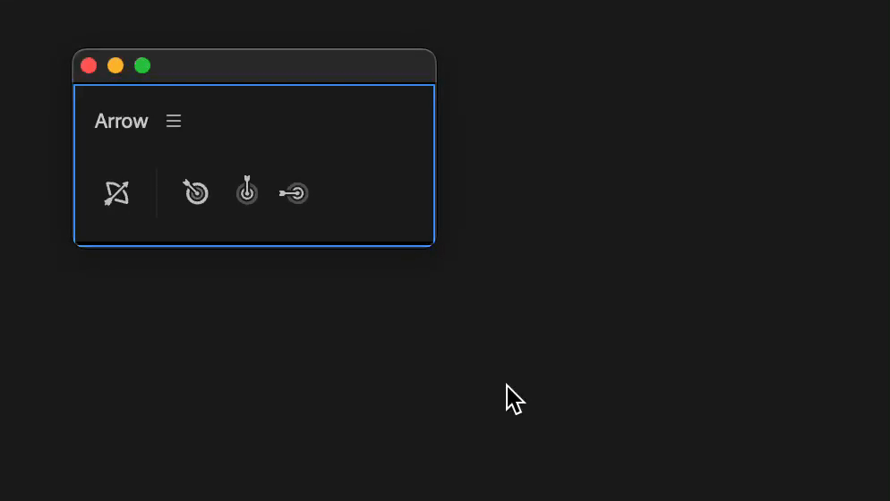

# Main panel

Arrow panel has 4 commands:

<figure><figcaption></figcaption></figure>


Arrow also works with the main panel closed.

To access commands assign shortcuts or control surface buttons with [Spell Book](../spell-book/).


### Copy

Copies a frame at the playhead from a timeline to the clipboard.

### Paste

Pastes an image from the clipboard to a timeline at the playhead position.

Pasted image will be created in project panel and moved to `Arrow` bin.

Then it will be added at the bottom targeted track.

There are 3 types of paste command.

<table><thead><tr><th width="155">Paste type</th><th>Action</th></tr></thead><tbody><tr><td>Overlay</td><td>If targeted track has a clip at playhead, pasted image will be added to first empty track above.</td></tr><tr><td>Overwrite</td><td>Ignores any clip at playhead and overwrites it with pasted image.</td></tr><tr><td>Insert</td><td>Ignores any clip at playhead, inserts pasted image and pushes forward all clips on a targeted track.</td></tr></tbody></table>


If you don't need a specific type of a paste command, right click on a panel and uncheck it.


<figure><figcaption></figcaption></figure>

