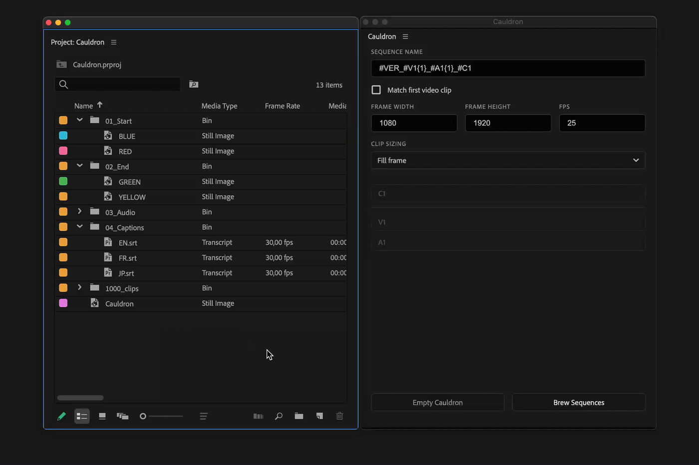
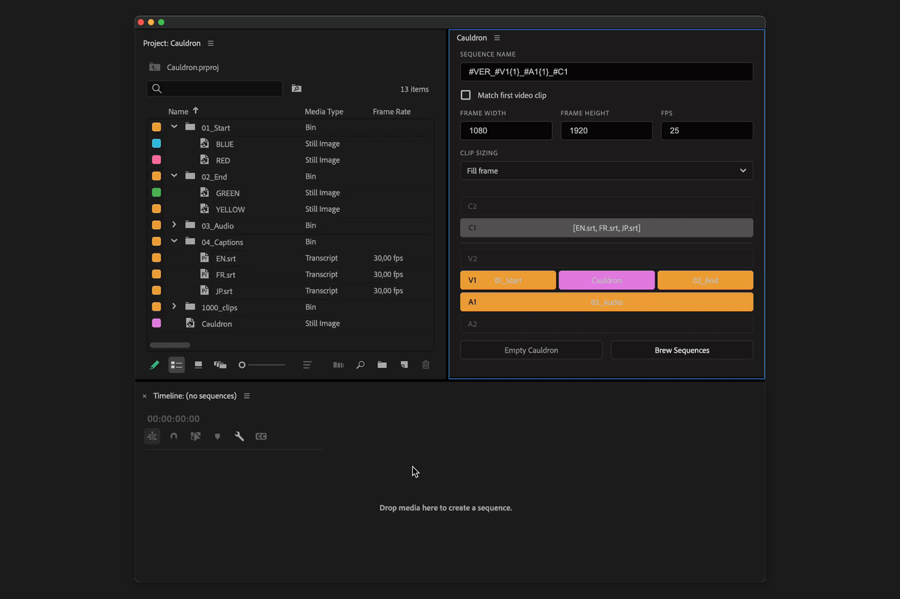

# How it works

## Create Sequences

To create sequences, drag and drop clips from Project panel to Cauldron timeline.\
Adjust settings if needed and press "Brew Sequences" button.

<figure><figcaption></figcaption></figure>

<figure><figcaption></figcaption></figure>

* It is possible to add one clip or group of clips.
* It is possible to combine any amount of clips on video and audio tracks, but only 1 clip is allowed per caption track.

In/Out points of source clips will be used.


If clip duration inside sequence needs to be adjusted — change clip in/out point or duration and re-generate sequences again.


### Group of clips

When group of clips is added, Cauldron will iterate over each clip inside the group and create all possible combinations of sequences.

It is possible either to select group of clips or just bin with clips inside, it will also act as a group.


When a bin is added to Cauldron, you can add/remove clips from it and generate updated version of sequences.


### Remove clips

To remove clips from Cauldron, right click on a clip and select "Delete".

If you want to remove all clips, use "Empty Cauldron" button.

## Sequence Settings

### Sequence name

Cauldron creates multiple sequences, so it is good to have name that reflects what is inside of a sequence. Wildcards allow to create dynamic names for sequences.

<table><thead><tr><th width="202">Wildcard</th><th>Description</th></tr></thead><tbody><tr><td><strong>#V1{1}</strong></td><td>use name of 1 clip on the first video track</td></tr><tr><td><strong>#A2{3}</strong></td><td>use name of 3 clip on the second audio track</td></tr><tr><td><strong>#C1</strong></td><td>use name of caption clip on the first audio track</td></tr><tr><td><strong>#VER</strong></td><td>version of a sequence</td></tr></tbody></table>

### Width, Height, FPS

Disable `Match first video clip` checkbox to set custom width, height and fps for created sequences.&#x20;

### Clip Sizing

3 options availble:

* None — clips size stays unchanged
* Fill Frame — clip will fill the frame of a sequence (crop might occur)
* Fit Frame — clip will fit the frame of a sequence vertically or horizontally
