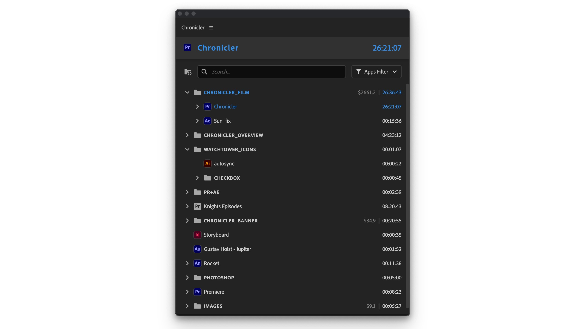
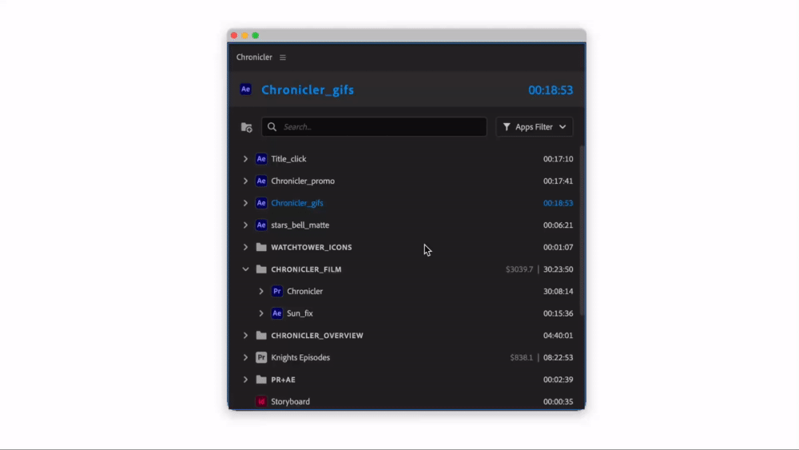
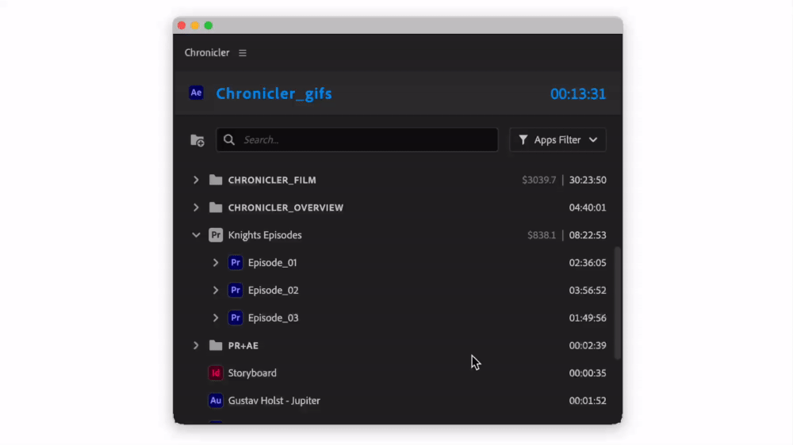

# Main Panel

Main panel consists of 3 parts:

* header with current active project
* search/filter buttons
* projects and folders

<figure><figcaption></figcaption></figure>

### Drag reorder

It is possible to reorder projects and group them inside folders. Select one or more items and drag them to reorder.

<figure><figcaption></figcaption></figure>

### Context menu

To access context menu, right click on item in the main panel.

<figure><figcaption></figcaption></figure>

<table><thead><tr><th width="236">Command</th><th>Action</th></tr></thead><tbody><tr><td>New Folder</td><td>Create new folder</td></tr><tr><td>Billable</td><td>Enable/disable billing for project/folder</td></tr><tr><td>Change Rate...</td><td>Change billing rate for selected projects</td></tr><tr><td>Delete</td><td>Delete selected projects (log won't be affected)</td></tr><tr><td>Reveal in Finder/Explorer</td><td>Reveal project in Finder/Explorer</td></tr><tr><td>Export CSV...</td><td>Export CSV log for selected projects</td></tr><tr><td>Settings</td><td>Open settings menu</td></tr></tbody></table>
