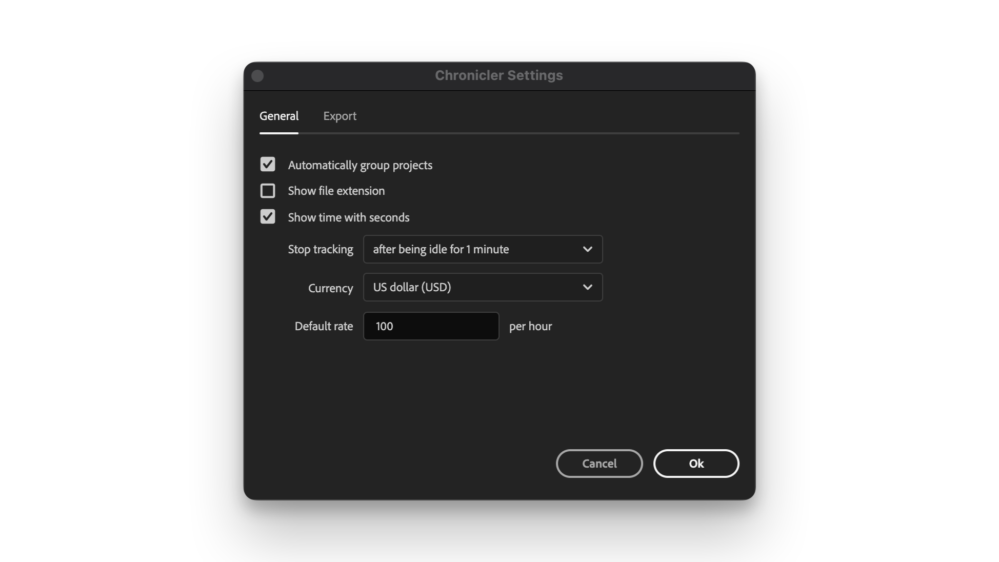
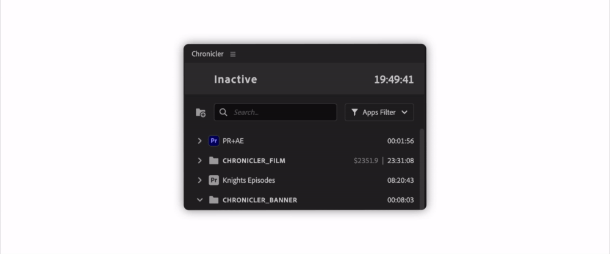
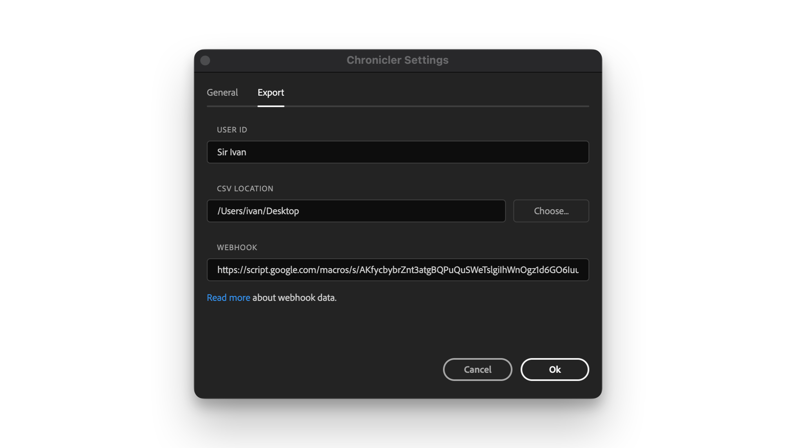

# Settings

To open settings window, right click on Chronicler panel and select `Open Settings`

## General

<figure><figcaption></figcaption></figure>

### Automatically group projects

Chronicler will automatically group linked projects in the same folder.

For example a Premiere project can include After Effects Dynamic Link and Photoshop files:\
a folder will be created with the name of parent project and all linked projects will be placed inside that folder.

<figure><figcaption></figcaption></figure>

### Show file extension

If enabled, project names will also include file extension, e.g.:

```
Photo.psd, Edit.prproj, Vector.svg
```

### Show time with seconds

Show either "HH:MM" or "HH:MM:SS", e.g.:

```
Enabled : 10:12:03
Disabled: 10:12
```

### Stop tracking after being idle for X minute(s)

If user is inactive, Chronicler will stop tracking. It is possible to set up to 60 minutes of idle time.

### Currency & Default Rate

Define default rate for projects with billing. It is possible to change billing for every project individually.

***

## Export

<figure><figcaption></figcaption></figure>

### User ID

Set user ID which will be linked to Chronicler data genarated on a computer. It is useful if you collect data from multiple machines and you want to distinguish between them.

### CSV Location

CSV file will be automatically created in predefined location.

### Webhook

Add url to post data to. All data is live and is posted as you work.

#### JSON structure:

<table><thead><tr><th width="190">Key</th><th>Description</th></tr></thead><tbody><tr><td>user_id</td><td>User ID, can be defined in Settings -> Export tab</td></tr><tr><td>app_id</td><td>Application ID</td></tr><tr><td>unix_start</td><td>Start time in UNIX</td></tr><tr><td>unix_end</td><td>End time in UNIX</td></tr><tr><td>date</td><td>Date in "YYYY-MM-DD" format</td></tr><tr><td>start</td><td>Start time in "HH:MM:SS" format</td></tr><tr><td>end</td><td>End time in "HH:MM:SS" format</td></tr><tr><td>folder</td><td>Folder name in Chronicler panel</td></tr><tr><td>production</td><td>Production name (only for Premiere Pro)</td></tr><tr><td>project</td><td>Project name</td></tr><tr><td>project_item</td><td>Project item name</td></tr><tr><td>project_item_type</td><td>Project item type: projectpanel, document, multicam, sequence</td></tr><tr><td>duration</td><td>Duration in "HH:MM:SS" format</td></tr><tr><td>duration_hours</td><td>Duration in hours</td></tr><tr><td>rate</td><td>Rate set in Chronicler panel</td></tr><tr><td>sum</td><td>Sum = duration_hours * rate</td></tr><tr><td>project_id</td><td>Project ID (could be project path or different ID)</td></tr><tr><td>untitled_id</td><td>Project ID before it was saved to disk</td></tr></tbody></table>

### Google Sheet script example

```javascript
function doPost(e) {
  const sheetName = "Sheet Name";
  const sheet = SpreadsheetApp.getActiveSpreadsheet().getSheetByName(sheetName);
  const data = JSON.parse(e.postData?.contents);
  sheet.appendRow([
    data.user_id,
    data.app_id,
    data.unix_start,
    data.unix_end,
    data.date,
    data.start,
    data.end,
    data.folder,
    data.production,
    data.project,
    data.project_item,
    data.project_item_type,
    data.duration,
    data.duration_hours,
    data.rate,
    data.sum,
    data.project_id,
    data.untitled_id
    ])
}
```
