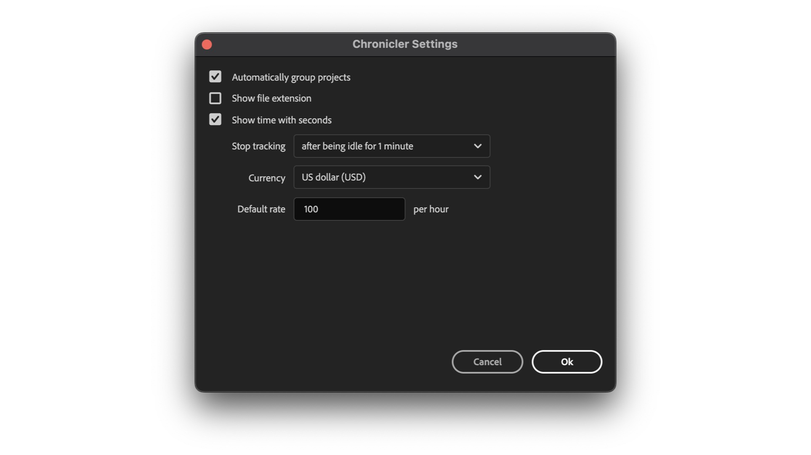

# Settings

<figure><figcaption></figcaption></figure>

### Automatically group projects

Chronicler will automatically group linked projects in the same folder.

For example a Premiere project can include After Effects Dynamic Link and Photoshop files:\
a folder will be created with the name of parent project and all linked projects will be placed inside that folder.

<figure><figcaption></figcaption></figure>

### Show file extension

If enabled, project names will also include file extension, e.g.:

```
Photo.psd, Edit.prproj, Vector.svg
```

### Show time with seconds

Show either "HH:MM" or "HH:MM:SS", e.g.:

```
Enabled:  10:12:03
Disabled: 10:12
```

### Stop tracking after being idle for X minute(s)

If user is inactive, Chronicler will stop tracking. It is possible to set up to 60 minutes of idle time.

### Currency & Default Rate

Define default rate for projects with billing. It is possible to change billing for every project individually.
