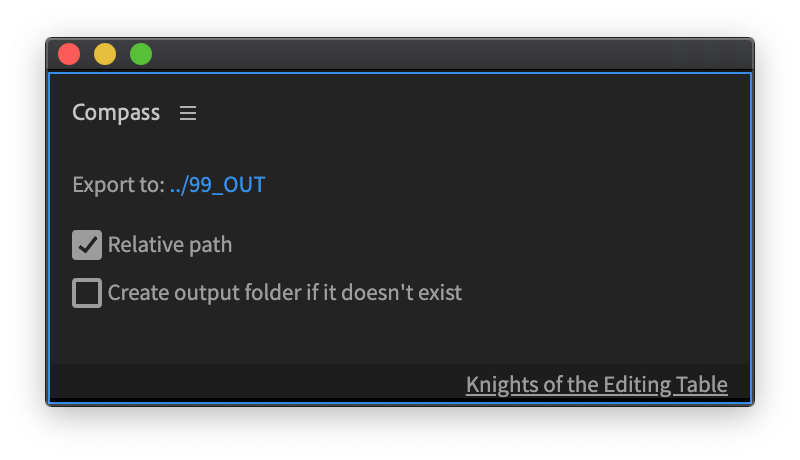
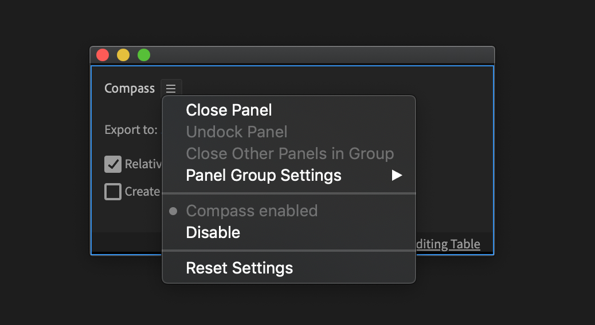

# How it works

## Main Panel

Compass interface has 3 settings:

* Export path
* Enable Relative path
* Create output folder

Compass can be disbaled/enabled in hamburger menu and also there it is possible to reset settings.

## Supported Export types

Compass supports 3 types of export:

* Direct export from Premiere Pro
* Quick Export
* Export from Media Encoder queue

