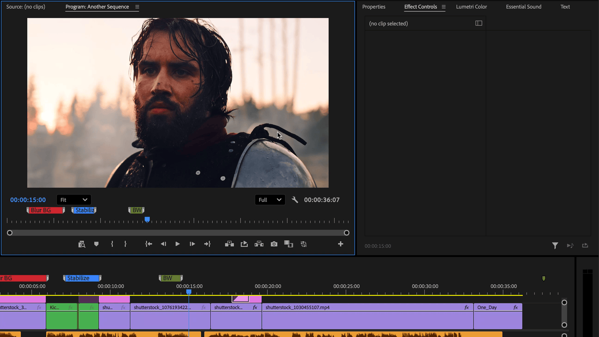

# Search bar

## How it works

* Select a clip or group of clips
* Open Dagger search bar with a shortcut assigned in [Spell Book](<../spell-book/README (1).md>)
* Type name of a effect
* Select it and press `Enter`

<figure><figcaption></figcaption></figure>


You can assign shortcut to any effect in [Spell Book](spell-book-shortcuts.md)


### First Letters search

Search for effects with first letters, separated by whitespace.

| Effect Name     | Search Example |
| --------------- | -------------- |
| Warp Stabilizer | w s            |
| Volumetric Rays | v r            |

### Persistent position

Move Dagger search bar to any position on your screen and it will remember it.
