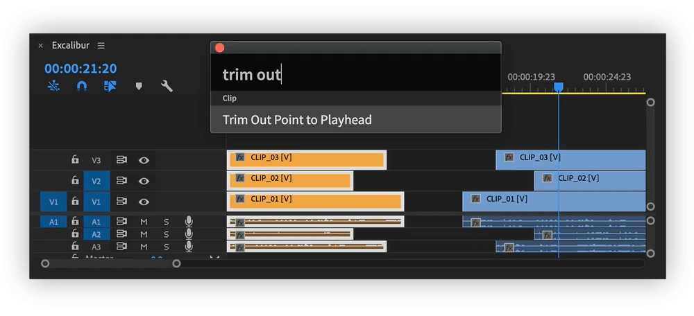

# Clip

## Position, Scale, Rotation, Anchor Point, Anti-flicker Filter, Opacity, Volume

### Set value

Replaces existing value with a new one. If property has stopwatch enabled, linear keyframe will be created.

### Add value

Adds or substracts from existing value. If property has stopwatch enabled, linear keyframe will be created.


Create  two User Commands for scale, using **add value** setting:  
`scale_up:   +5  
scale_down: -5`  
Assign keyboard for each command. Now it is possible to control clip scale with a keyboard.

Same is useful for position, rotation and other properties.


## Blend Mode

Changes blend mode of selected clips.

## Speed

Changes speed of selected clip, without affecting its duration.

## Duration

Changes duration of selected clip, without affecting its speed.

### Ripple Edit OFF

### Ripple Edit ON

To keep the clips following the changing clips next to them.

## Reverse

Reverses clip

## Rename

Renames clip.  
If multiple clips are selected, all clips will get same name.

## Fill Frame

Scales clip, so it fills frame.

## Paste Clip

Pastes clips from clipboard to specified track.

### On the same track

### On the highest enabled track

### On the lowest enabled track


In Premiere Pro CC 2019, "Paste Clip" command works only with clips that were copied in clipboard. Cut clips will be ignored.


## Nest Clips

Creates nested sequence from selected clips and moves it to "Nested Clips" bin.

By default nested sequence named:  
`ParentSequenceName_nest_counter`


It is possible to nest audio clips!


## Nest Individual Clips

Creates nested sequences from **each** selected clip and moves it to "Nested Clips" bin.

By default nested sequences named:  
`ParentSequenceName_ClipName_nest_counter`

## Trim In/Out Point to Playhead

Trims In/Out Point of selected clips to Playhead.

If there is already another clip at playhead position, trim will be performed to End/Start of this clip.


This command can not be undone.  
**UI bug**: after performing command some selected clips might look like they are not selected.


## Move Clip Start/End to Playhead

Moves clips Start/End to Playhead.

If there is already another clip at playhead position, move will be performed to End/Start of this clip.


This command can not be undone.  
**UI bug**: after performing command some selected clips might look like they are not selected.


## Remove Transitions

Removes transitions from selected clips or whole sequence

### From Selected Clips

### From Sequence \(all transitions\)

