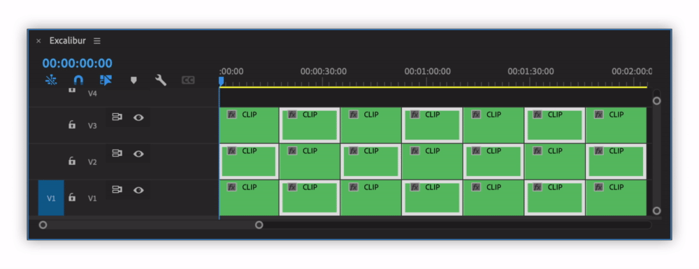

# Selection

## Select Clip Above/Below

Selects clip on a track above/below selected clip at playhead position.

## Extend Selection

Extends clips selection to left/right/up/down.

## Select All Clips after/before Playhead

#### Options

* All Tracks
* All Targeted Tracks
* All Video Tracks
* All Audio Tracks
* Tracks with selected clips

## Invert Selection

#### Options

* Tracks with selected clips
* All Tracks
* All Targeted Tracks
* All Video Tracks
* All Audio Tracks

## Select All Disabled Clips

Exports XML of active sequence and selects all disabled clips.

