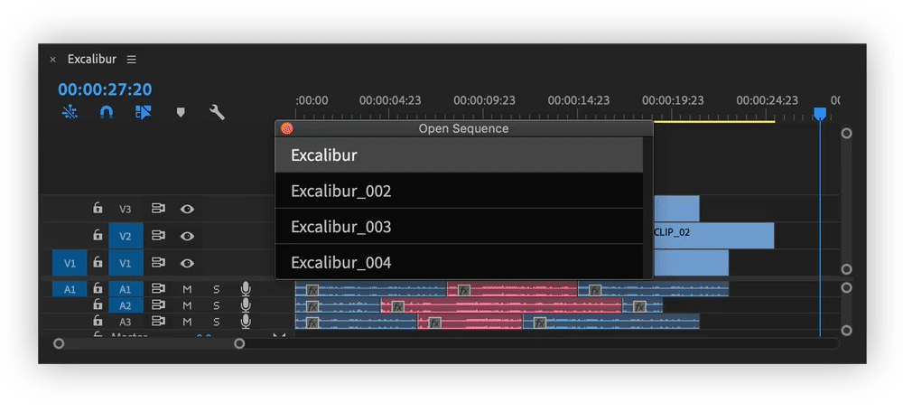
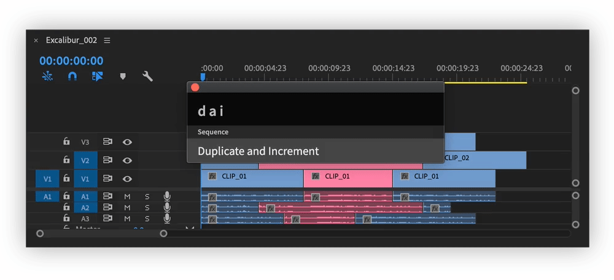
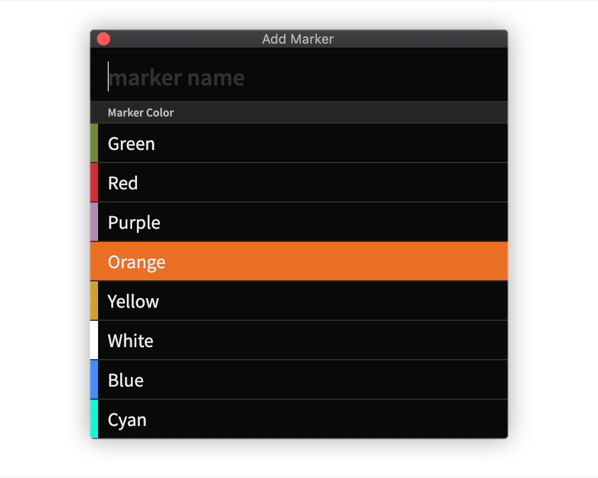
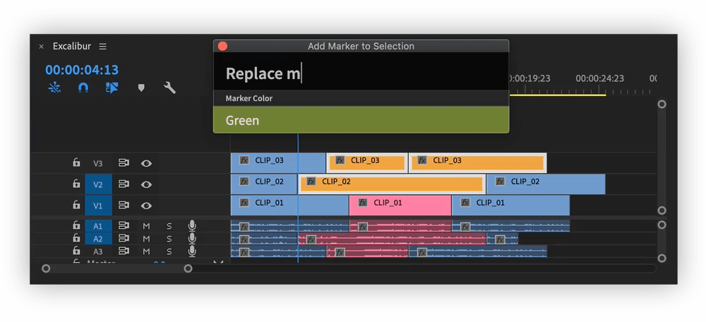
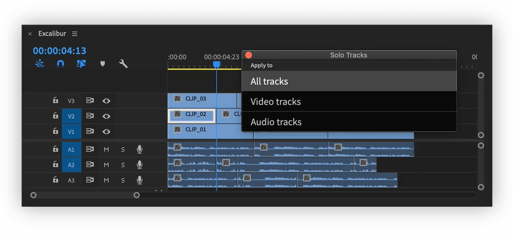
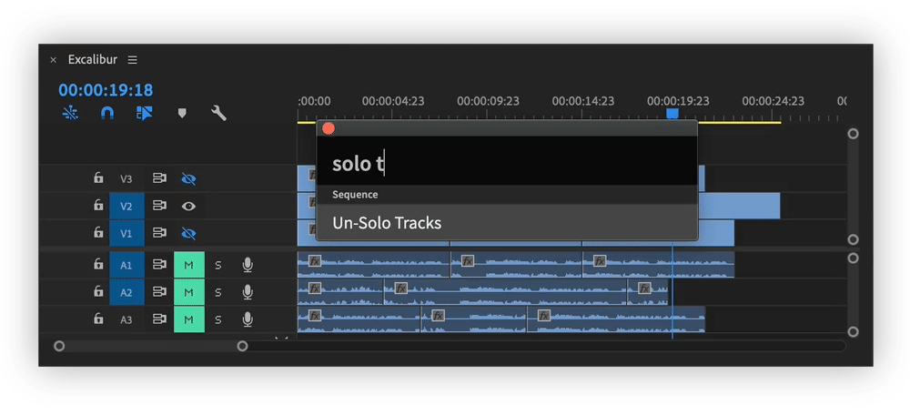
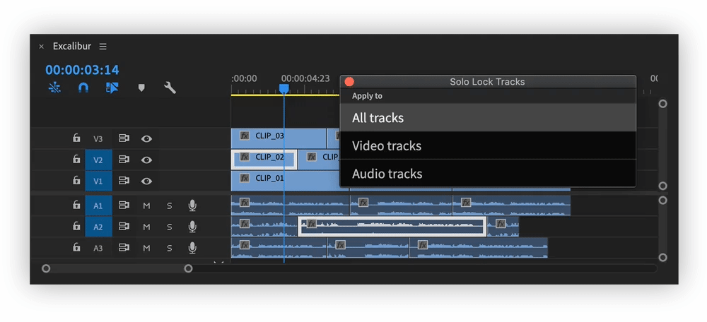
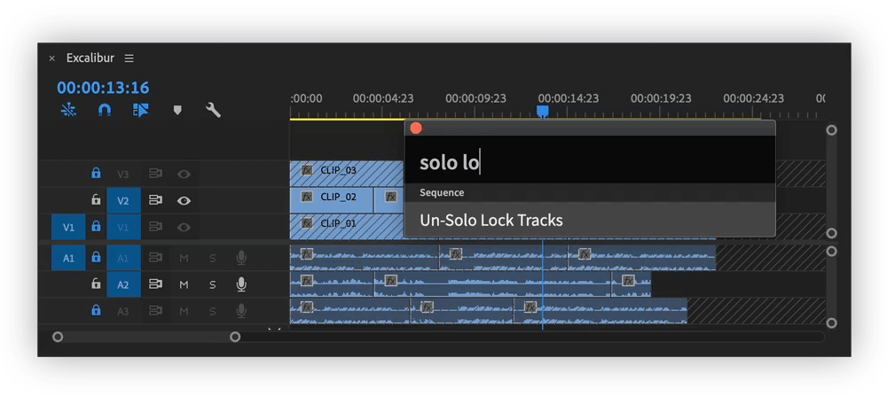
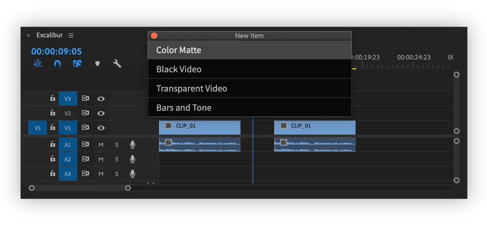

# Sequence

## Open Sequence

Shows list of all sequences in the project and opens selected one.

## Duplicate and Increment

Duplicates active sequence to "Archived Sequences" bin and opens new \(identical\) sequence with incremented name.

| Before | After |
| :--- | :--- |
| SequenceName\_006 | SequenceName\_007 |

## Add Marker

Adds marker with specified name and label colour at playhead position.

## Add Marker to Selection

Adds marker with specified name and label colour, which has duration of current selection.

## Solo Tracks

Toggles off track output/Mutes all tracks except ones that have clips selected.

Submenu has options to use this command for:

* All tracks
* Video tracks
* Audio tracks

After "Solo Tracks" command was used, it will appear as "Un-Solo Tracks", executing it will reset toggles/mutes to original value.

## Solo Lock Tracks

Locks all tracks except ones that have clips selected.

Submenu has options to use this command for:

* All tracks
* Video tracks
* Audio tracks

After "Solo Lock Tracks" command was used, it will appear as "Un-Solo Lock Tracks", executing it will reset locks to original value.

## New Item

Will create syntetic media file, with same settings as active sequence and overwrites it on the lowest enabled track

Available Items:

* Adjustment layer
* Color Matte
* Black Video
* Transparent Video
* Bars and Tone

