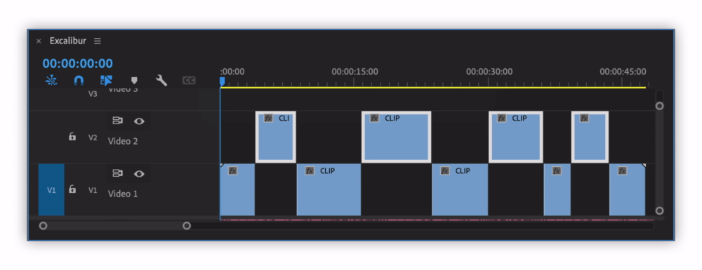
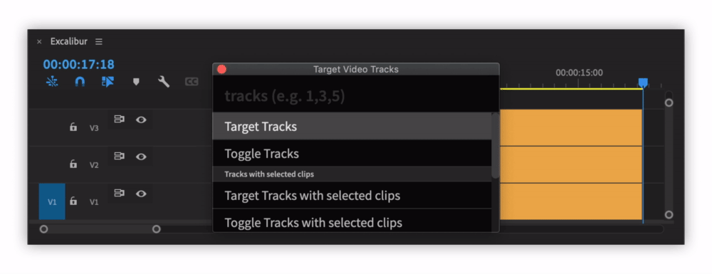
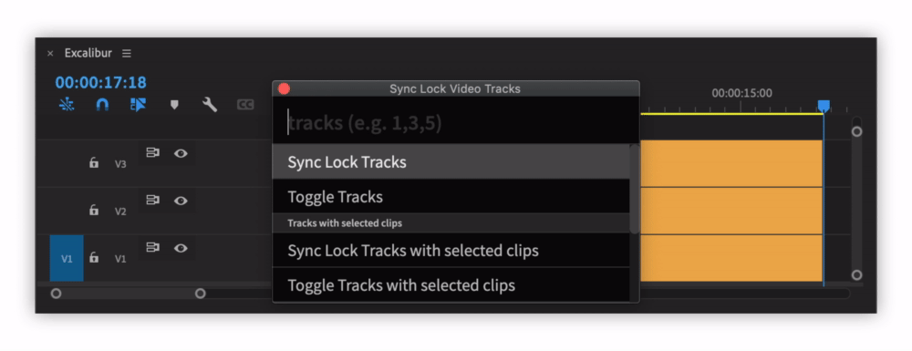

# Sequence

## Open Sequence

Shows list of all sequences in the project and opens selected one.

## Duplicate and Increment

Duplicates active sequence to "Archived Sequences" bin and opens new \(identical\) sequence with incremented name.

| Before | After |
| :--- | :--- |
| SequenceName\_006 | SequenceName\_007 |

## Add Marker to Sequence

Adds marker to active sequence with specified name and label colour at playhead position.

## Add Marker to Selection

Adds marker to active sequence with specified name and label colour, which has duration of current selection.

## Add Marker to Clip

Adds marker to a clip with specified name and label colour, which has duration of the selected clip.

## Target Video/Audio Tracks

Targets specified tracks.

| **Option** | Behaviour |
| :--- | :--- |
| **Target tracks** | Number input, targets **specified tracks\***, additive behaviour |
| **Toggle tracks** | Number input, toggles only **specified tracks\*** |
| **Target tracks with selected clips** | Targets tracks with selected clips, additive behaviour |
| **Toggle tracks with selected clips** | Toggles only tracks with selected clips |
| **Target All tracks** | Targets all tracks |
| **Toggle All tracks** | Toggles all tracks. If at least one track is targeted, will toggle all tracks off. |
| **un-Target All tracks** | Toggles all tracks off. |

**\*** To affect multiple tracks, type track numbers separated by comma

## Mute Video/Audio Tracks

Mutes specified tracks. For list of options look at [Target Video/Audio Tracks](sequence.md#target-video-audio-tracks).

## Lock Video/Audio Tracks

Locks specified tracks. For list of options look at [Target Video/Audio Tracks](sequence.md#target-video-audio-tracks).

## Sync Lock Video/Audio Tracks

Sync Locks specified tracks. For list of options look at [Target Video/Audio Tracks](sequence.md#target-video-audio-tracks).

## Solo Mute Tracks

Toggles off track output/mutes all tracks except ones that have clips selected.

Submenu has options to use this command for:

* All tracks
* Video tracks
* Audio tracks

After "Solo Mute Tracks" command was used, it will appear as "un-Solo Mute Tracks", executing it will reset toggles/mutes to original value.

## Solo Lock Tracks

Locks all tracks except ones that have clips selected.

Submenu has options to use this command for:

* All tracks
* Video tracks
* Audio tracks

After "Solo Lock Tracks" command was used, it will appear as "un-Solo Lock Tracks", executing it will reset locks to original value.

## New Item

Will create syntetic media file, with same settings as active sequence and overwrites it on the lowest enabled track

Available Items:

* Adjustment layer
* Color Matte
* Black Video
* Transparent Video
* Bars and Tone

