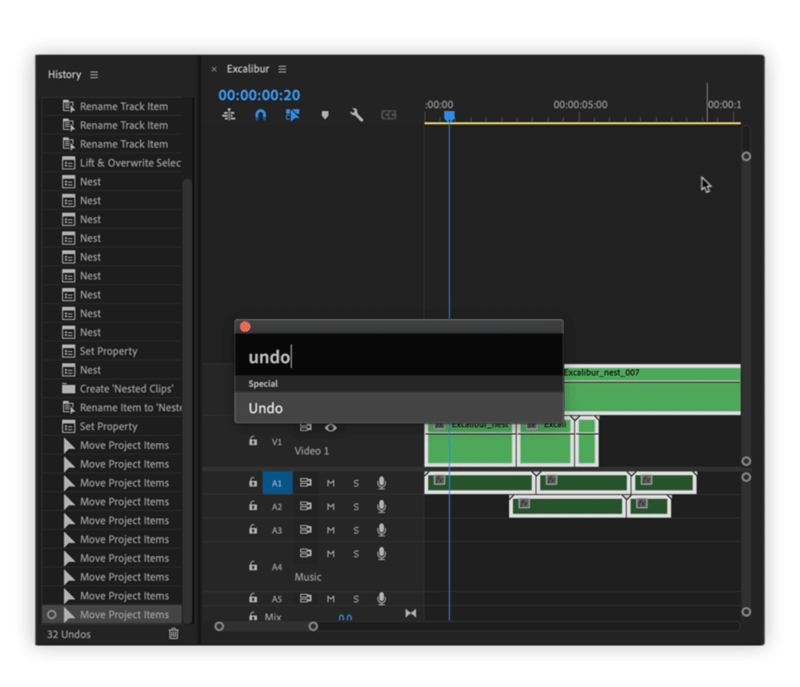

# Special

## **Undo**

Undos Excalibur commands. It respects order of native Premiere Pro and Excalibur commands, so if there is no Excalibur command to undo, it will undo Premiere Pro command. When working on timeline, you can completely switch to Excalibur Undo.


Be careful in case you have this order of actions executed:

1. Native command
2. Native command
3. Excalibur command

If you use native undo command, you will get to **\#1** in history stack and record of Excalibur command **\#3** will be lost.


