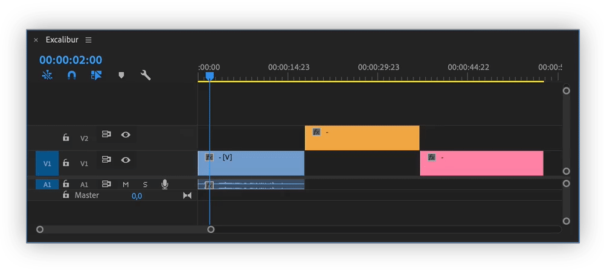
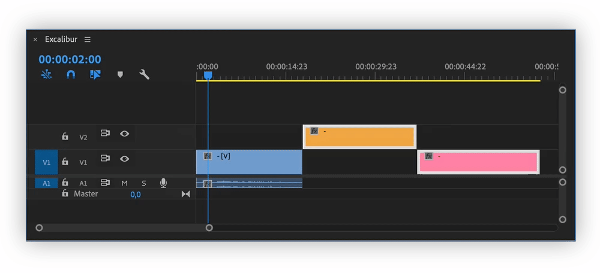

# Timecode

When using numpad in Premiere Pro, one can control position of a playhead or selected clips by typing numbers and then pressing Enter/Return.

Not all laptops have numpad, so Excalibur timecode command becomes handy.

To control timecode, launch Excalibur search bar and type numbers, it is also possible to use calculation signs before numbers: **`+, -, *, /`**

## Playhead control \(no clips selected\)

## Selected clips control

* To set a specific timecode, type a new timecode, and then press Enter/Return.
* To adjust the current timecode by using a relative value, type calculation sign `(+, –, *, /)` and the number of frames to add, subtract, or number to multiply or divide by. For example, to subtract five frames from the current timecode, type `–5`, and then press Enter/Return.

**Use shorthand substitutes while entering timecode**

When entering timecode, you can use shorthand substitutes affixed with period \(..\). For example, timecode value of **4..** jumps to the position 00:04:00:00. Premiere Pro interprets the numbers you type as hours, minutes, seconds, and frames.

Examples of shorthand substitutes:

* **1.** moves the CTI to position 00:00:01:00
* **2..** moves the CTI to position 00:01:00:00
* **.1** moves the CTI to position 00:00:00:01
* **.24** moves the CTI to position 00:00:01:00 for a 23.976 fps sequence
* **.1234** moves the CTI to position 00:00:51:10 for a 23.976 fps sequence


Great tutorial from Colin Smith on how to use numpad: [link](https://www.youtube.com/watch?v=sOY9AVll2Sc)  
Adobe Premiere Pro user guide on timecode: [link](https://helpx.adobe.com/premiere-pro/user-guide.html/premiere-pro/using/timecode.ug.html)


