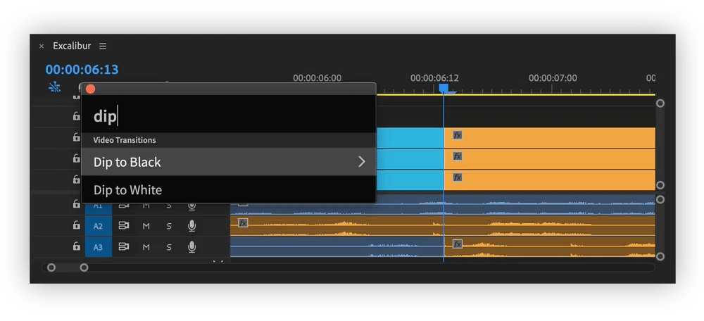
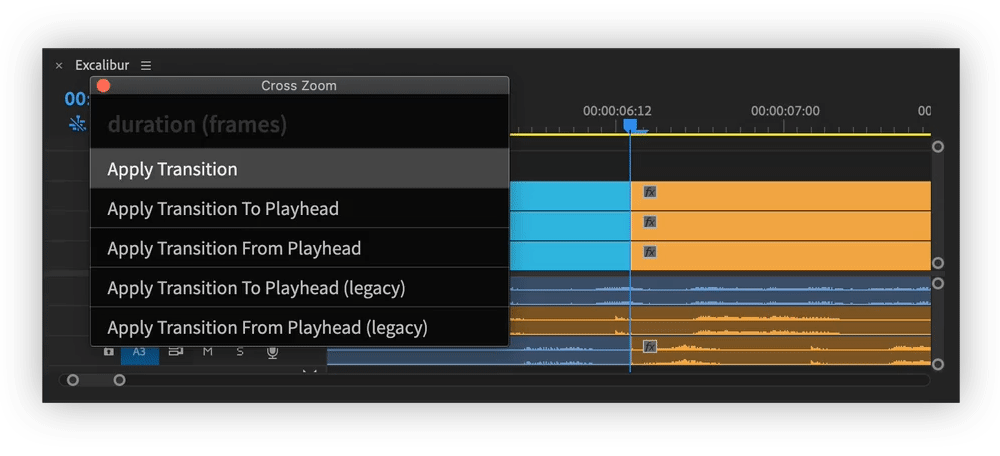
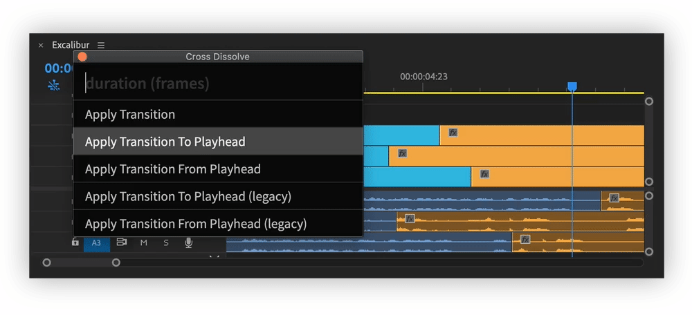
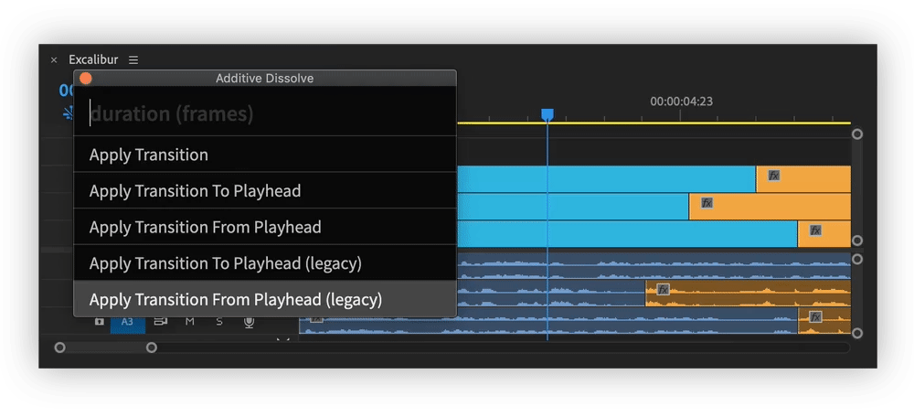

# Video/Audio Transitions

There are 5 ways to apply transitions.

By default **Apply Transition** command will be used with default transition duration \(could be set in `Premiere Pro>Preferences>Timeline`\)


When switching keyboard layout in Keyboard shortcuts, save project, for Excalibur to see that it was changed.


## Apply Transition

Applies transition to cuts under playhead.  
If cuts are selected, transition will be applied to them,  
If clips are selected, transition will be applied to in/out points of selected clips.


"Apply Transition" command presses **Apply Video/Audio Transition** shortcuts. Make sure they are assigned in Keyboard Shortcuts menu.


## Apply Transition To/From Playhead

Applies transition to cuts on the left/right of playhead and stretches transition to playhead position.

In comparison to [legacy](video-audio-transitions.md#apply-transition-to-from-playhead-legacy) version, "Apply Transition To/From Playhead" adds proper transition between clips.


"Apply Transition To/From Playhead" command presses **Select Clip at Playhead**, **Apply Video/Audio Transition** shortcuts. Make sure they are assigned in Keyboard Shortcuts menu.


## Apply Transition To/From Playhead \(legacy\)

Applies transition to cuts on the left/right of playhead and stretches transition to playhead position. \(Standard Premiere Pro command\)

"Apply Transition To/From Playhead \(legacy\)" doesn't add transition between clips, but adds fade to/from black/silence.


"Apply Transition To/From Playhead" command presses **Apply Default Video/Audio Transition to/from Playhead** shortcuts. Make sure they are assigned in Keyboard Shortcuts menu.


