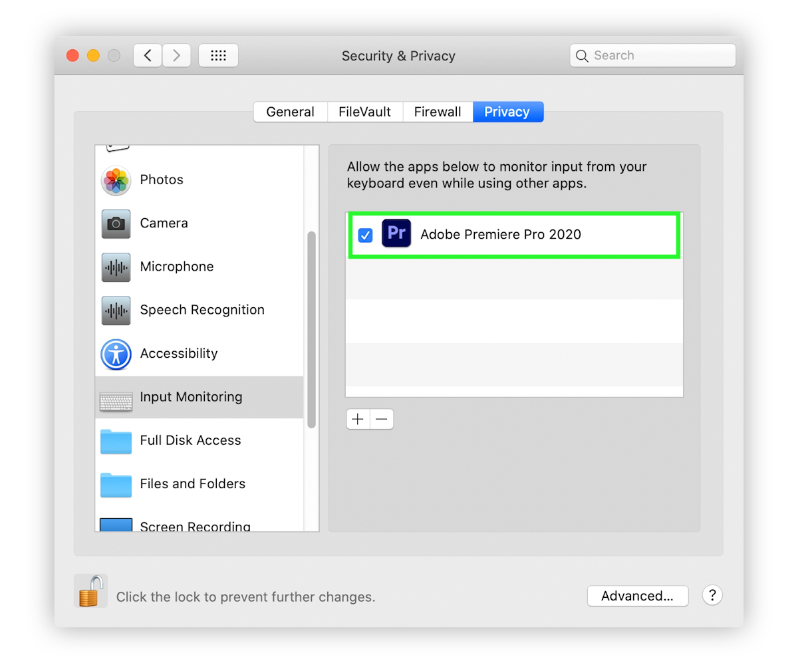

# macOS Permissions

To allow Excalibur work properly, you will need to give Accessibility permissions for Premiere Pro.

Normaly, after Excalibur installation, when opening Premiere Pro, it should prompt you with dialogs:

If you don’t have these pop-ups, you can grant permissions manually. Go to:  
**System Preferences &gt; Security & Privacy &gt; Privacy.**  
Go to each section, hit “+", find your Premiere Pro version, add it, make sure it has a tick mark.

## Accessibility \(Mojave and above\)

## Input monitoring \(Catalina and above\)

## Reset permissions

Sometimes macOS doesn't have permissions right, to reset them do this:

* give permissions to Premiere Pro \(accessibility/input monitoring\), skip if permissions already granted
* untick Premiere Pro in permissions
* restart computer
* tick Premiere Pro back in permissions
* launch Premiere Pro and test

