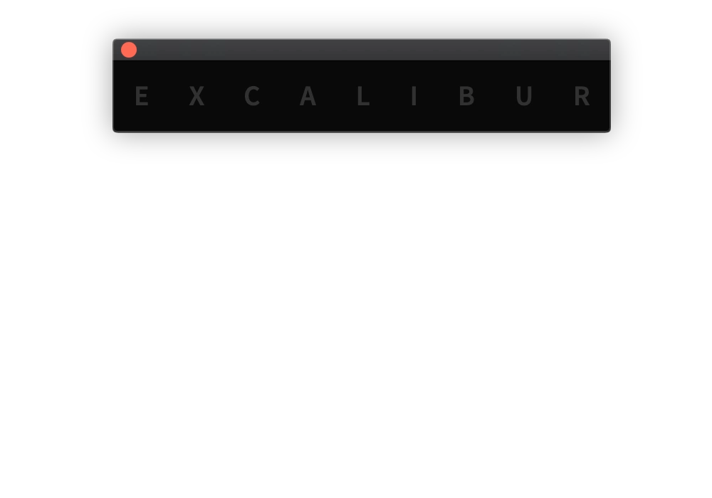
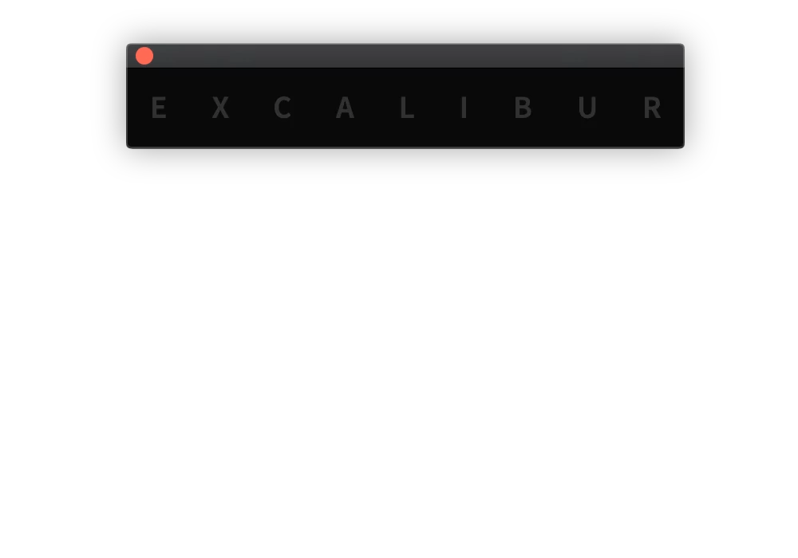
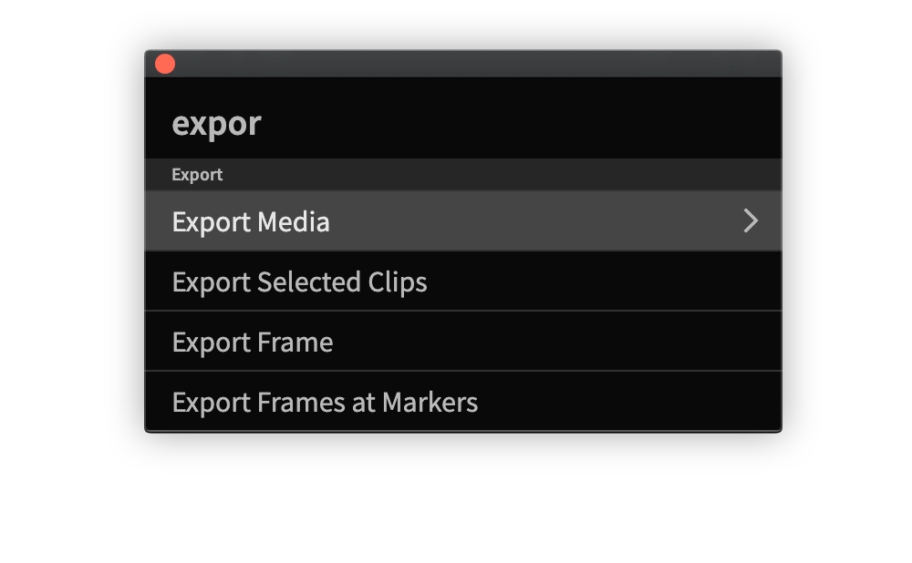

# Search Bar

## Search

### Standard search

Type name of command and Excalibur will show you results matchting your query. You can navigate with **arrows** to select command \(or mouse\), and press **Enter/Return** \(or click\) to execute it.

### First Letters search

To search for command faster, it is possible to type first letters of command name, divided by space.

| Command Name | Search Example |
| :--- | :--- |
| Warp Stabilizer | w s |
| Add Marker to Selection | a m t s |

## Submenu

Some of the commands have a right arrow near the name. That means that command has a submenu, where user can customise its parameters.

To access submenu press **Right Arrow** or **Enter/Return**.


There are few commands that have a default execution:  
[Add Transition](../commands/video-audio-transitions.md), [Audio Effects](../commands/video-audio-effects.md#audio-effects), [Nest Clips](../commands/clip.md#nest-clips), [Solo Tracks](../commands/sequence.md#solo-tracks), [Solo Lock Tracks](../commands/sequence.md#solo-lock-tracks), [Remove Transitions](../commands/clip.md#remove-transitions).  
When **Enter/Return** is pressed default parameters will be used. To access submenu for these commands use **Right Arrow**.


