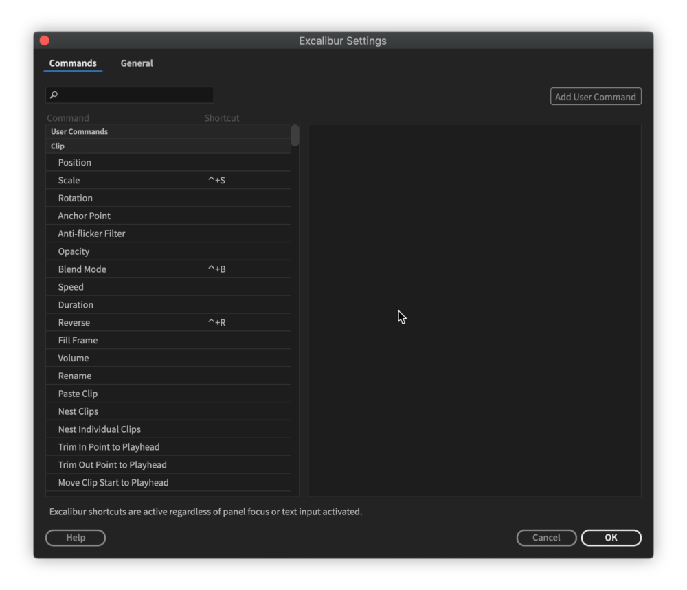
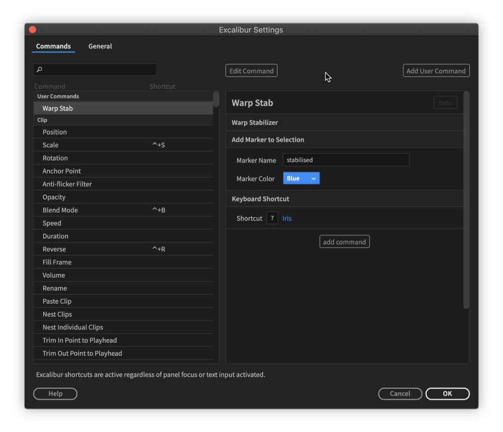
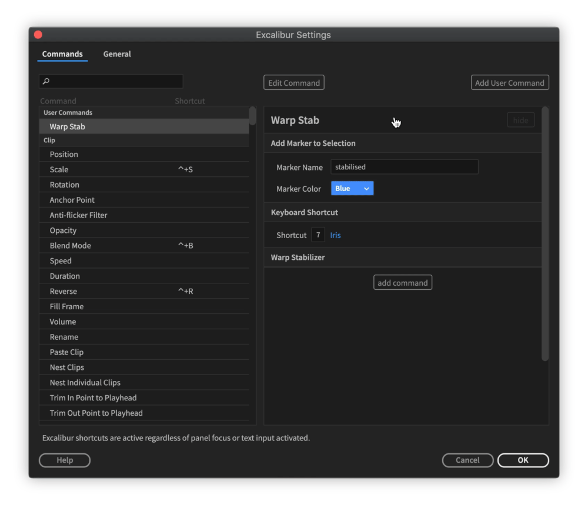

---
layout:
  title:
    visible: true
  description:
    visible: false
  tableOfContents:
    visible: true
  outline:
    visible: true
  pagination:
    visible: true
---

# User Commands

User Command consists of one and more customised Excalibur commads, so it is possible to create combos/macros/workflows that fit your needs.

User Command has special command: [Keyboard Shortcut](keyboard-shortcut.md).\
When used it will press defined shortcut.

## Create User Command

* Open Settings and click "Add User Command" button. User command can have custom name and as any other command assigned shortcut.
* Click on "add command" button, search bar will appear, type name of command you want to add and press **Enter/Return** (or click on it).
* You can customise some of the commands.
* If you need another command to add, click on "add command" button again.

## Edit User Command

* Select User Command and click on "Edit Command" button.
* To reorder commands, click on "**≡**" symbol. Commands will fold, now click and drag "**≡**" symbol. After release, commands will unfold again.

* To delete one of commands, press red button with cross to the left of command name.
* To delete User Command, press red button with cross to the left of User Command name.

