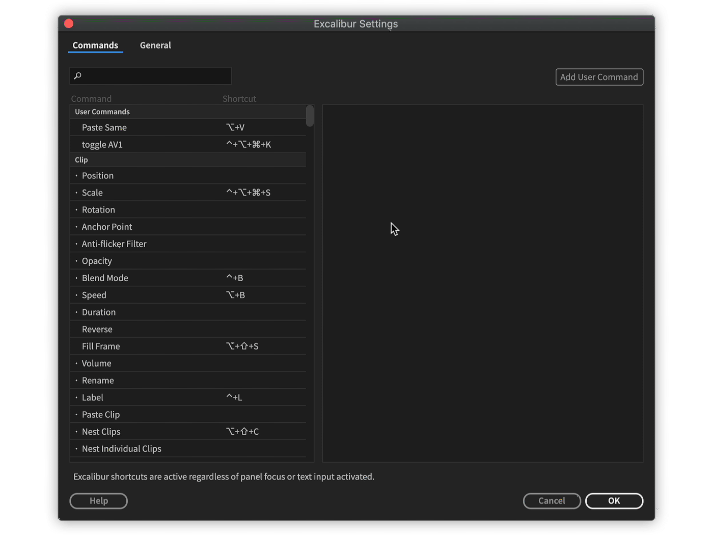

# Extensions

Some of Knights' extensions allow to use their commands with Excalibur.

Create user commands, for additional automation.

<figure><figcaption></figcaption></figure>

## Supported extensions

* [Quiver](../../quiver/)
* [Grave Robber](../../grave-robber/)
* [Anchor](../../anchor/)
* [Arrow](../../arrow/)


Excalibur 1.1.4 and above is needed to create user command with Knights' extensions

