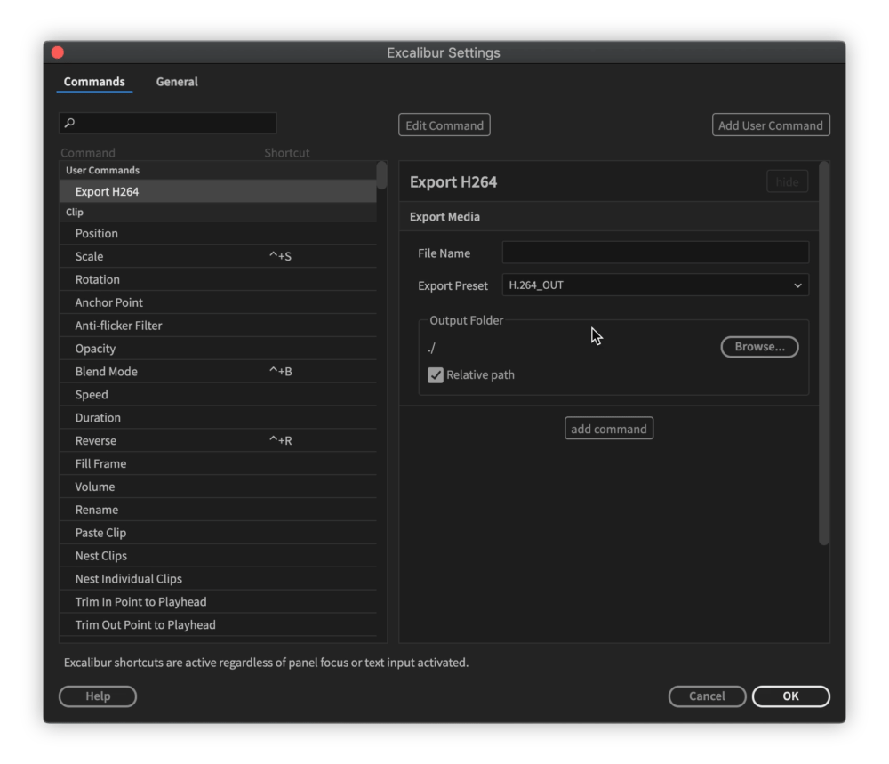

# Wildcards

When dealing with names \(Export, Nest commands\), User Command offers wildcard names. You can type it yourself or click on suggested wildcard and it will be added at cursor position.

