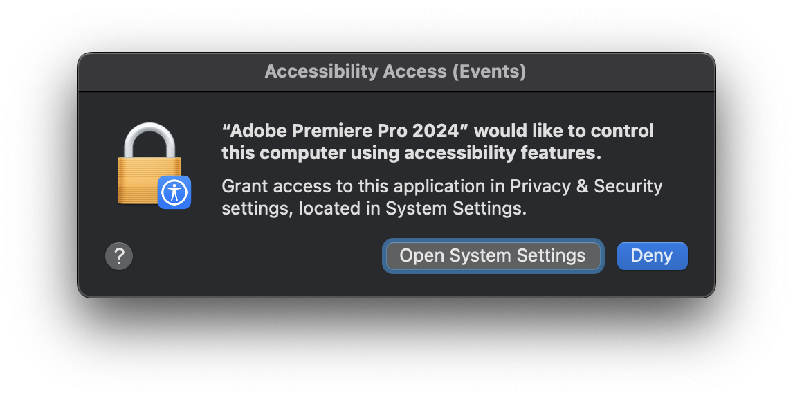
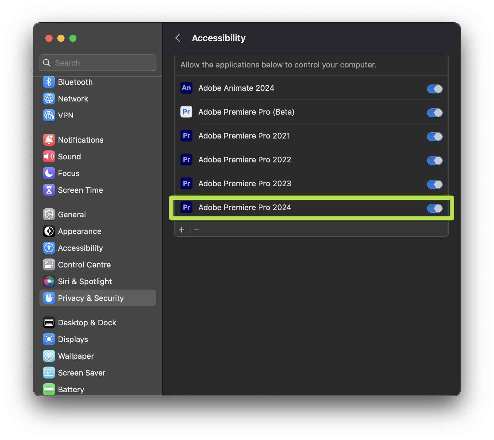

# macOS Permissions

To make Grave Robber work, one needs to give Accessibility permissions to Premiere Pro.

Normaly, after Grave Robber installation, when opening Premiere Pro, it should prompt you with dialog:

If you don’t have this pop-up, you can grant permissions manually. Go to:\
**System Preferences > Security & Privacy > Privacy.**\
Go to Accessibility section, hit “+", find your Premiere Pro version, add it, make sure it has a tick mark.

## Accessibility (Mojave and above)

## Reset permissions

Sometimes macOS doesn't have permissions right, to reset them do this:

* give permissions to Premiere Pro (accessibility/input monitoring), skip if permissions already granted
* untick Premiere Pro in permissions
* restart computer
* tick Premiere Pro back in permissions
* launch Premiere Pro and test
