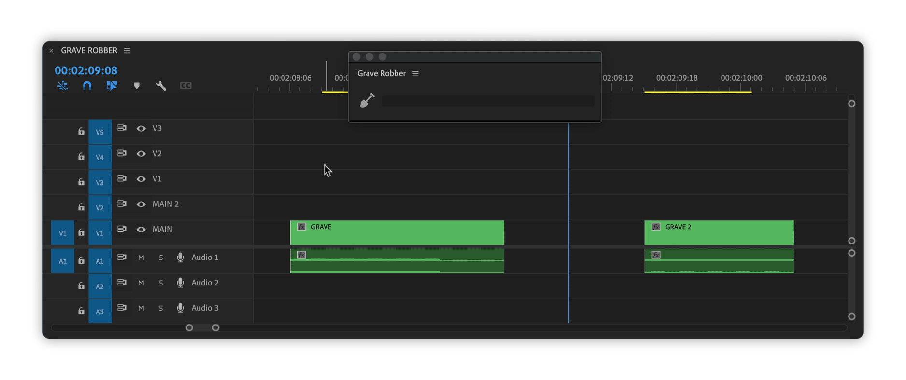

# How it works


**Merlin** control surface plugin is needed for Grave Robber to work.\
[Read](../../support-tools/merlin.md) how to add it.


1. Select clips on a timeline, that you want to un-nest or un-merge.\
   You can make a rough selection that will contain not just clips needed, but other clips as well (video, audio, essential graphics). Grave Robber will filter out not applicable clips.
2. Selected sequences will be opened one by one, clips inside copied to clipboard and after pasted to the main sequence.

Grave Robber will respect in/out point of nests, so no extra media will appear in the main sequence.

Grave Robber accounts for clip conflict, if there is an obstructing clip above a nest in the main sequence, new tracks will be added for un-nested clips.

