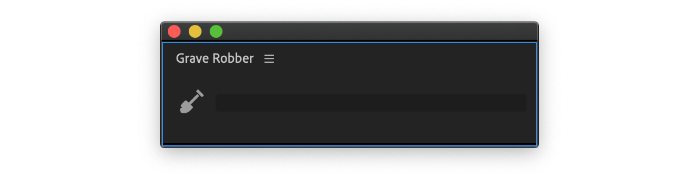
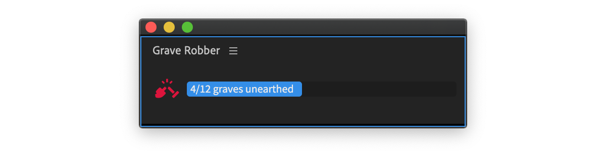

# Main Panel

Main panel has one button — a spade. When clicked Grave Robber will un-nest selected nests.

It is possible to abort un-nesting, for that press red button — a broken spade.


During un-nest, Grave Robber will generate multiple actions in History stack. To undo/redo them at once, just use Premiere Pro's undo command (support extension [Undead](../../support-tools/undead/) handles undo groups).

