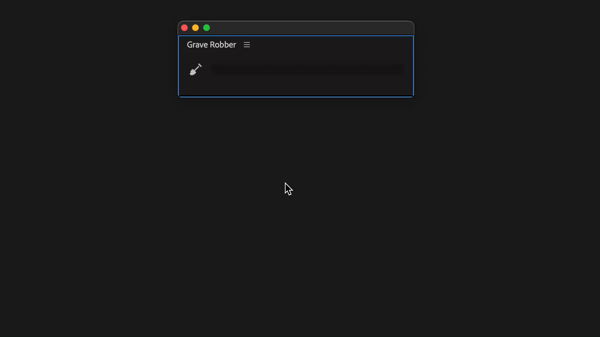

# Settings

To access settings, click on click on panel's flyout menu (3 horizontal lines near panel name).

<figure><figcaption></figcaption></figure>

## Unmerge clips

Merged clips will be unmerged.

## Disable Multi-camera clips

Multi-camera clips will be un-nested and clips that are not on selected camera track will be disabled.

## Link un-nested clips

Un-nested clips will be linked, when un-nesting _linked_ sequences.
