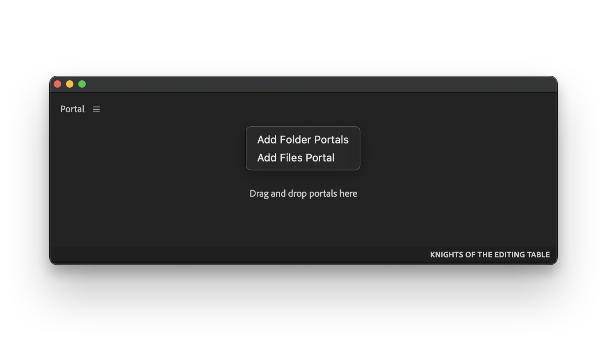
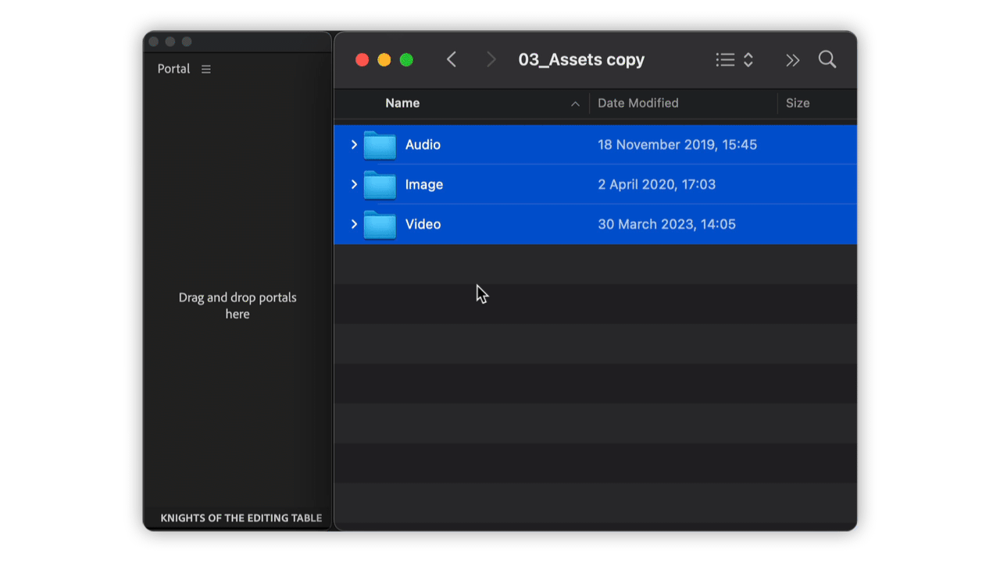
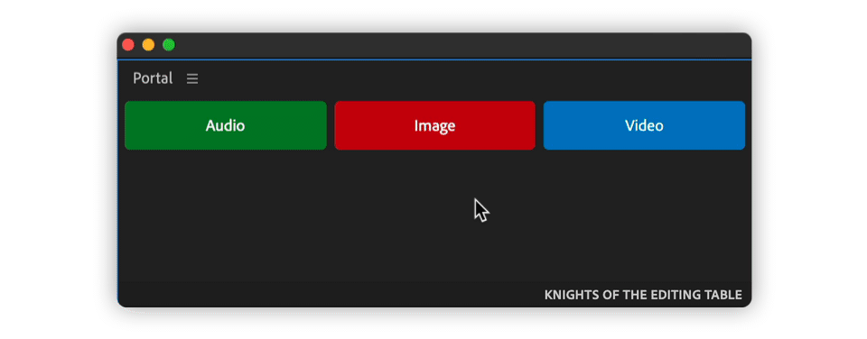
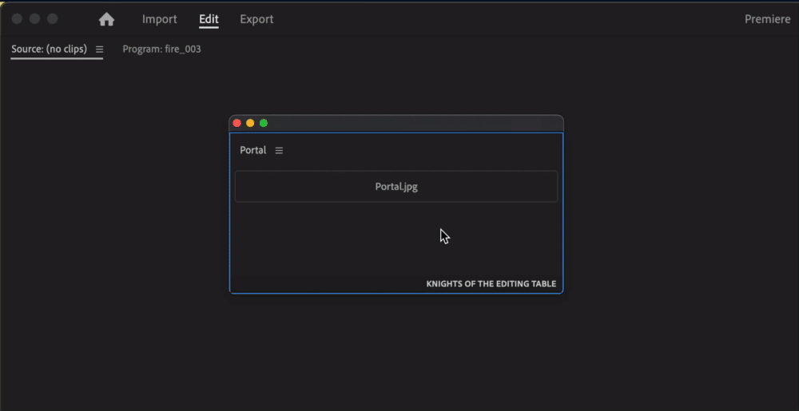

# How it works

## Add Portals

There are two options to add portals:

#### Context menu

Right click on empty space in Portal panel and select Add Portals.\
Finder/Explorer dialog will appear, select folders you want to add.

<figure><figcaption></figcaption></figure>

#### Drag and Drop

Drag and drop folders or files fom Finder/Explorer in Portal panel.

<figure><figcaption></figcaption></figure>


Portal keeps different sets of buttons for each Adobe app


## Reorder Portals

Click and drag a button to reorder it.

<figure><figcaption></figcaption></figure>

## File Portals

When file portal is clicked upon, file will be opened in OS default application.

<figure><figcaption></figcaption></figure>
