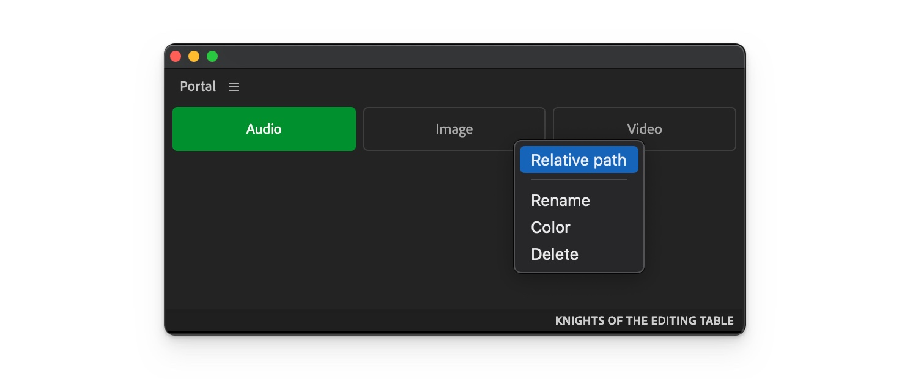
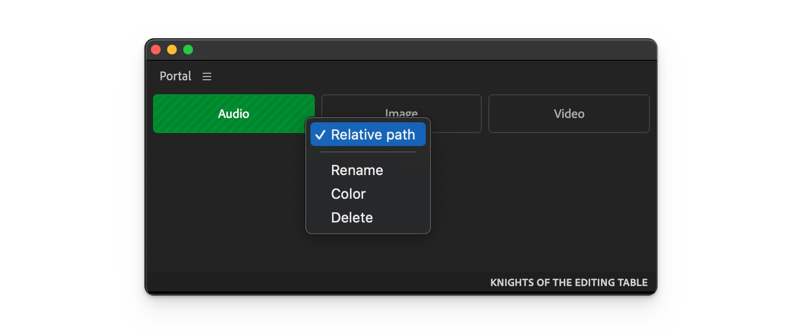

# Settings

Each button can be customised via context menu. Right click on a button and select one of the options.

<figure><figcaption></figcaption></figure>

#### Relative path

Folder path will be relative to project location. If relative path is enabled, button will have striped background.

<figure><figcaption></figcaption></figure>

#### Rename

Rename button. It doesn't affect folder path.

#### Color

Select button background color.

#### Delete

Delete button.
