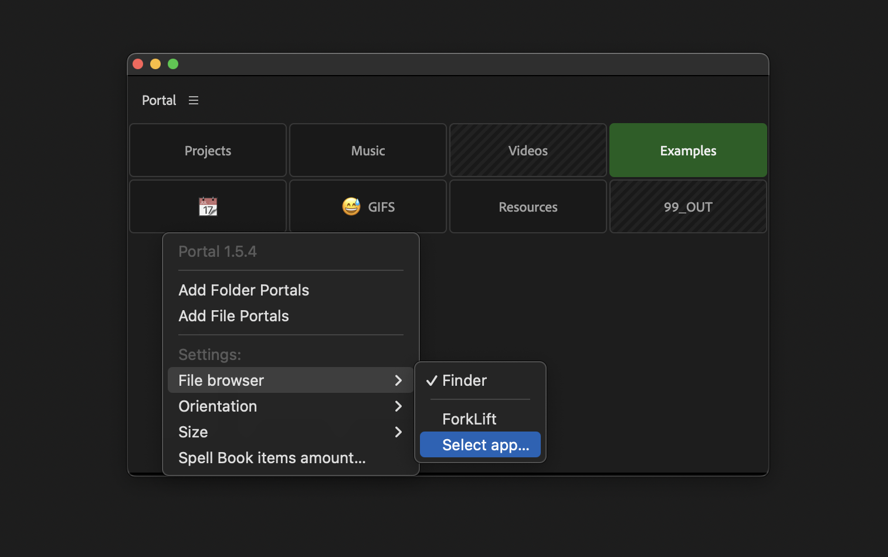
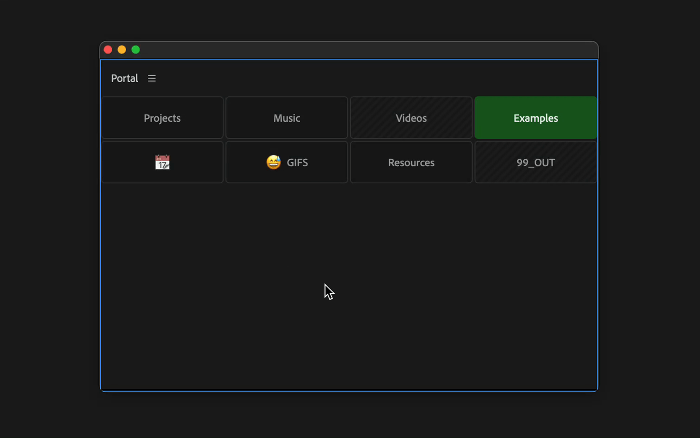
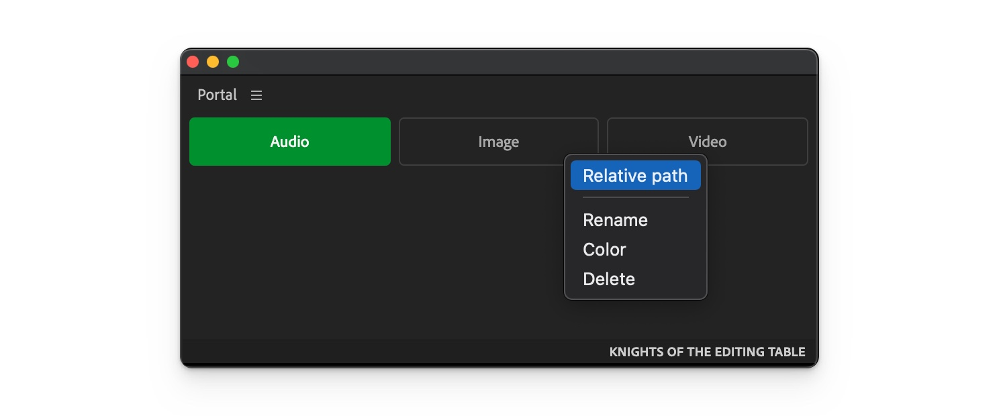
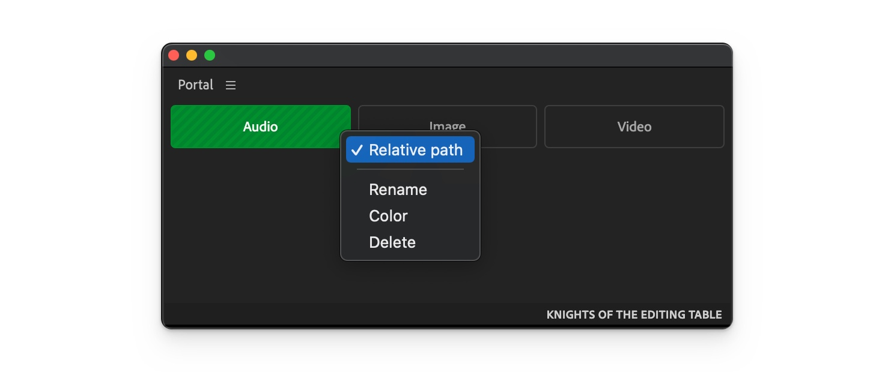

# Settings

## Panel settings

### File browser

Select file browser to open folder and files.

<figure><figcaption></figcaption></figure>

### Layout and size

Right-click on the toolbar to change layout and tile size.

Layouts available: **Grid**, **List**, **Horizontal**, **Vertical**.

Tile size can be **Small**, **Medium**, or **Large**.

<figure><figcaption></figcaption></figure>

## Button settings

Each button can be customised via context menu. Right click on a button and select one of the options.

<figure><figcaption></figcaption></figure>

#### Relative path

Folder path will be relative to project location. If relative path is enabled, button will have striped background.

<figure><figcaption></figcaption></figure>

#### Rename

Rename button. It doesn't affect folder path.

#### Color

Select button background color.

#### Delete

Delete button.
