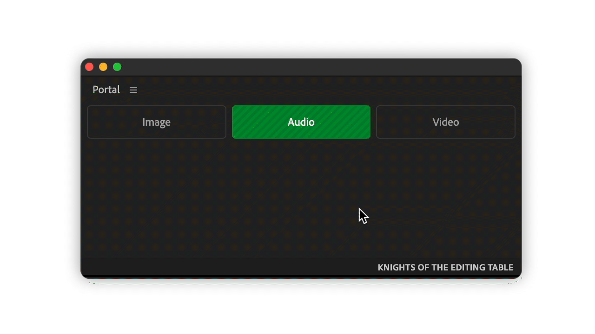

# What is it for?

> During work, there are folders that needed to be accessed constantly, some of them depend on an active project. Therefore Finder/Explorer should be opened and one should navigate to a folder in need.

Portal creates button shortcuts to folders right inside Adobe application, so just with one click user can open a folder.

<figure><figcaption></figcaption></figure>
