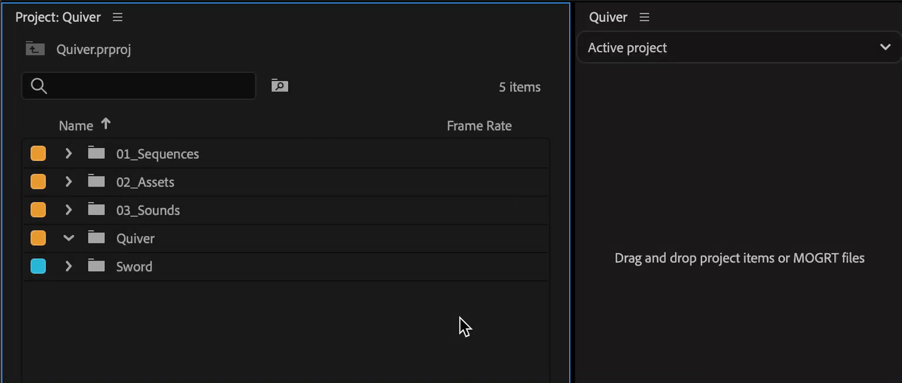
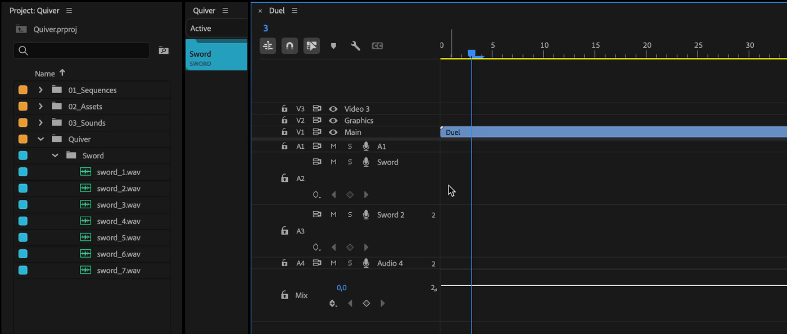
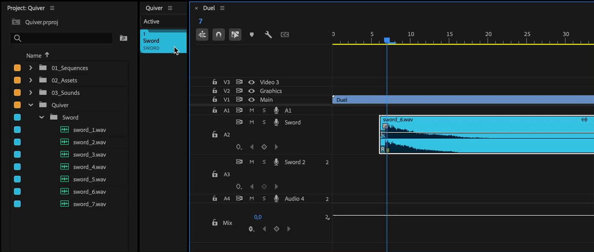

---
layout:
  title:
    visible: true
  description:
    visible: false
  tableOfContents:
    visible: true
  outline:
    visible: true
  pagination:
    visible: true
---

# Bin item

## Create Bin item

To create bin item, drag and drop a bin with clips onto Quiver panel.

<figure><figcaption></figcaption></figure>

## Random clips addition

When adding clips using the bin button, Quiver will randomly select one clip from the bin and add it at the playhead.

This is useful when you have multiple clips that share the same context, such as sfx, images, or even transitions that are created with the help of [sequence items](sequence-item-group-of-clips.md).

<figure><figcaption></figcaption></figure>

## Replacing selected clips

During replacement of selected clips, the bin button logic will switch from random picking to a consecutive one. Clips for replacement will be taken one by one from a bin.

<figure><figcaption></figcaption></figure>

