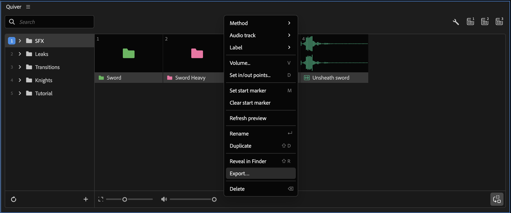
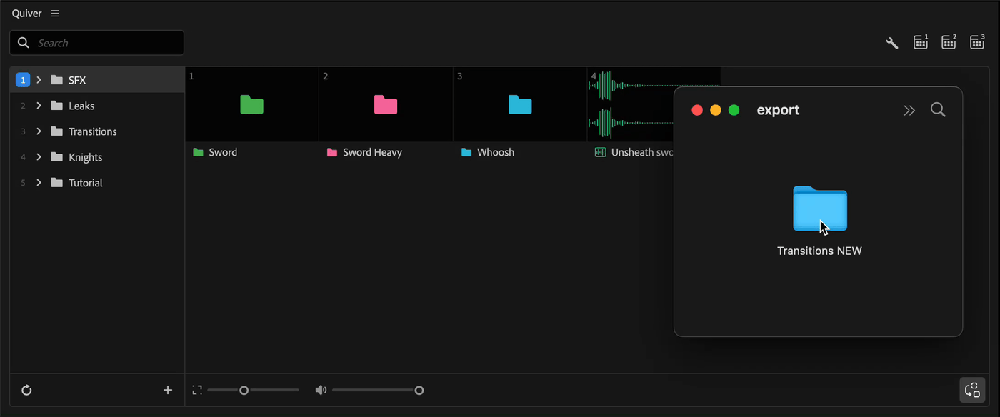

---
layout:
  width: default
  title:
    visible: true
  description:
    visible: false
  tableOfContents:
    visible: true
  outline:
    visible: true
  pagination:
    visible: true
  metadata:
    visible: true
  tags:
    visible: true
  actions:
    visible: true
---

# Export/Import

### Export

It is possible to share Quiver folders with other users.

Select folders or items and click on **Export** in context menu.

<figure><figcaption></figcaption></figure>

### Import

To import exported items, select and drag them onto Quiver main panel.

<figure><figcaption></figcaption></figure>
