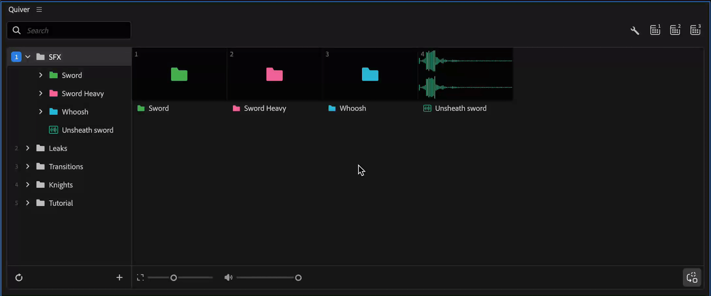
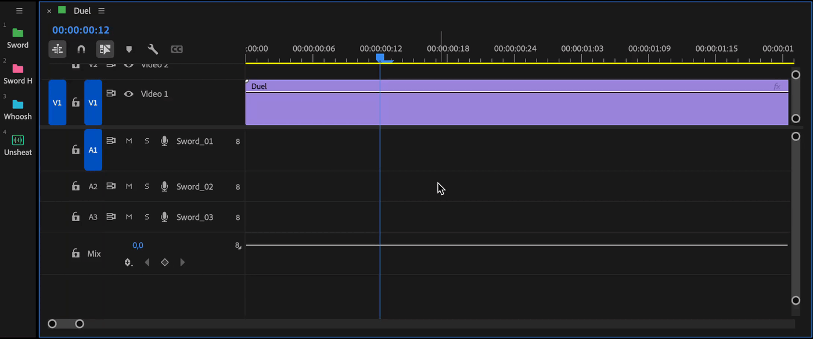
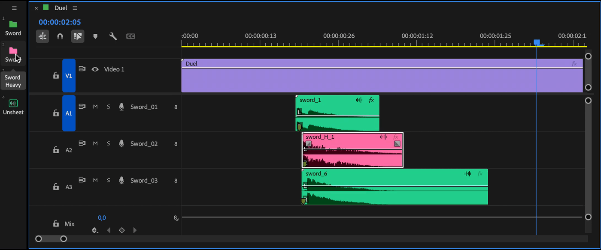

---
layout:
  width: default
  title:
    visible: true
  description:
    visible: false
  tableOfContents:
    visible: true
  outline:
    visible: true
  pagination:
    visible: true
  metadata:
    visible: true
  tags:
    visible: true
  actions:
    visible: true
---

# Folder item

### Create Folder item

Create a folder with the context menu (**New folder**, Shift+N) or by dragging items into an existing folder.\
You can also drag a bin from the Project panel onto the Quiver panel to import its contents as a folder.

<figure><figcaption></figcaption></figure>

### Random clips addition

When you double-click a folder (or click it in a toolbar), Quiver randomly selects one item from inside and adds it at the playhead.

This is useful when you have multiple clips that share the same context, such as sfx, images, or even transitions that are created with the help of [sequence items](sequence-item-group-of-clips.md).

<figure><figcaption></figcaption></figure>


To open a folder instead of adding a random item, hold `cmd/ctrl` while double-clicking in the main panel, or `cmd/ctrl` while clicking in a toolbar.


### Replacing selected clips

During replacement of selected clips, the bin button logic will switch from random picking to a consecutive one. Clips for replacement will be taken one by one from a bin.

<figure><figcaption></figcaption></figure>

