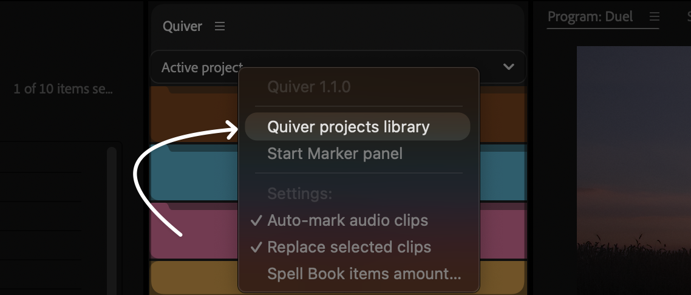
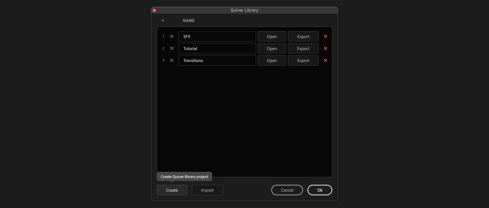
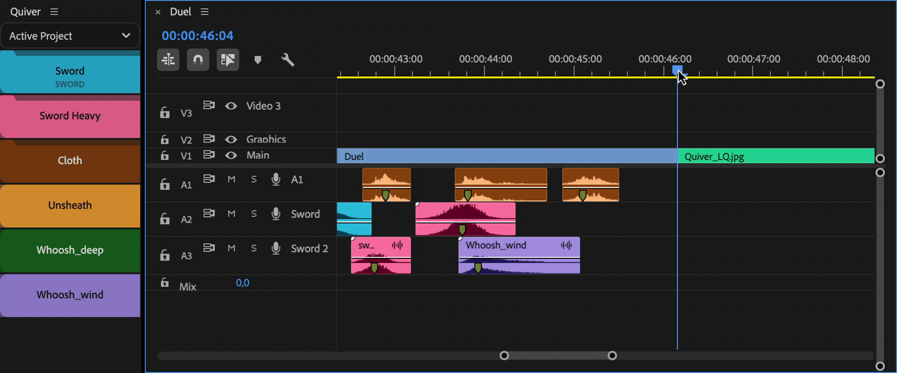
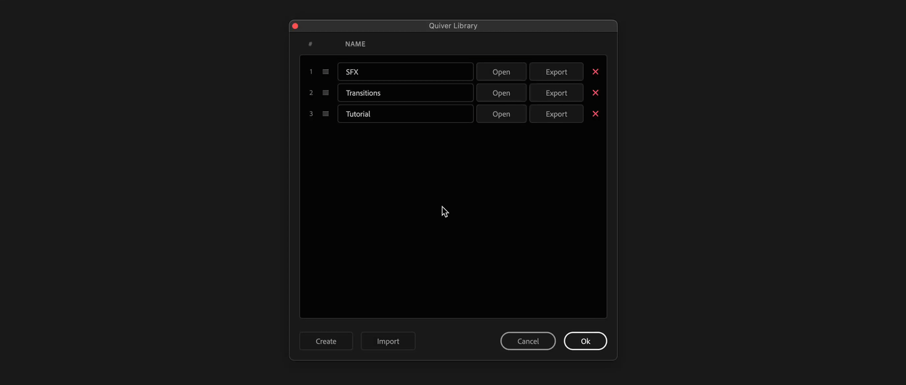
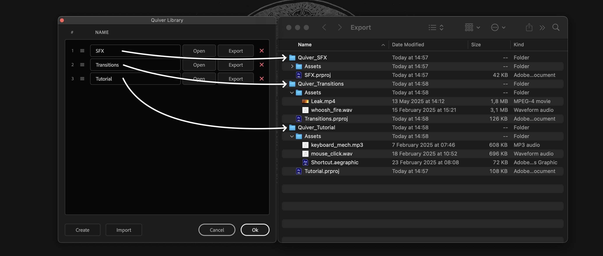

# Projects library

If "Active project" is selected in Quiver panel, it is only possible to add clips to a sequence inside the same project. So if new project will be opened, all Quiver items from previous project won't be accessible.

To make clips available to all projects, create a project in Quiver library.

## Create library project

Open Quiver library panel.

<figure><figcaption></figcaption></figure>

Click on "Create" button

<figure><figcaption></figcaption></figure>

## Modify library project

To modify project, open library project via Quiver Library panel.

Import clips, create bins, sequences and drag them over Quiver panel.

Adjust buttons settings, place start markers and save the project.

After that you can activate library project through dropdown menu in Quiver panel.

<figure><figcaption></figcaption></figure>

## Reorder library projects

To reorder projects, open Quiver Library and drag 3 lines to the left of the project name.

This will affect order in dropdown list and in Spell Book commands.

<figure><figcaption></figcaption></figure>

## Import / Export

It is possible to share Library projects with other users.

Click on "**Export**" button to export library project.

"**Quiver\_NameOfTheProject**" folder will be created with a project file inside and "**Assets**" folder.

<figure><figcaption></figcaption></figure>

Click on "**Import**" button and select `.prproj` file, to import Quiver library project.
