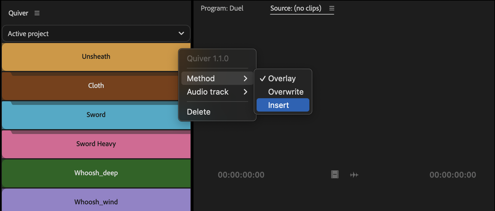
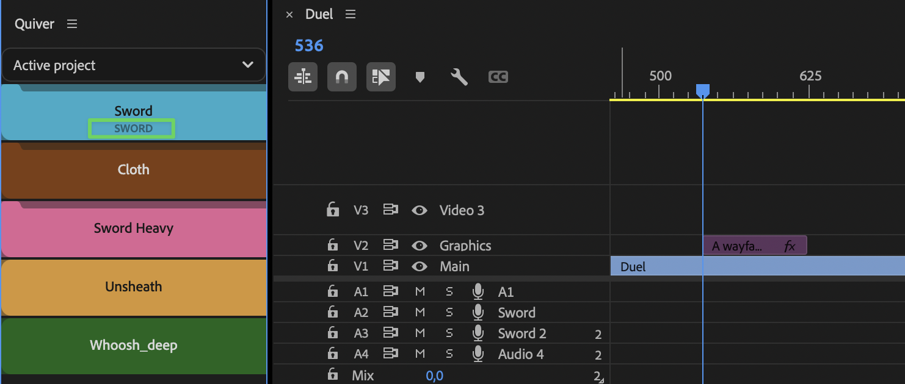
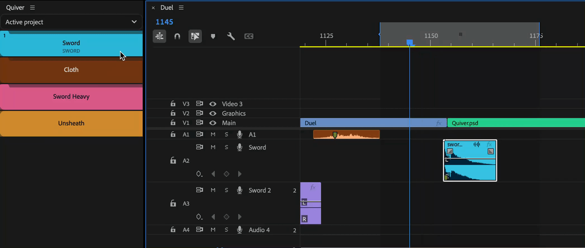

# Main panel

## Overview

The Quiver main panel is a file manager for your clip library. On the left is the folder tree; on the right is the preview pane with item tiles.

Top-level folders in the tree are **quiver folders**. The active quiver is highlighted with a blue box — shortcuts and Toolbar 1 add items from that folder.

<figure><figcaption></figcaption></figure>

## Add items

Add items using the context menu, the plus button, or drag and drop.

Right-click in the panel or on the plus button to create a **New folder**, **New item** (audio, video, still, or MOGRT), or **New sequence**. Shortcuts are shown in the menu.

<figure><figcaption></figcaption></figure>

You can also drag items from the Project panel or from your file manager (Finder on macOS, Explorer on Windows).

<figure><figcaption></figcaption></figure>

By default, added media is **copied** to the Quiver data folder. In [Settings](settings.md), you can switch to **reference mode**, where Quiver uses the original file path instead. Referenced items show a link icon in the corner.

<figure><figcaption></figcaption></figure>

While dragging and dropping, hold **Opt/Alt** to toggle between copy and reference mode for that drop.

### Add MOGRTs

MOGRT files can be added by dragging them from your file manager onto the Quiver panel, or by creating a **New item** and selecting a MOGRT file.


You can change the label color of a MOGRT item added to a timeline by setting the label on the Quiver item.


## Navigation

Click a folder in the tree to open it in the preview pane.

* **Double-click** an item to add it to the timeline
* **Double-click** a folder to add a random item from inside that folder
* **Cmd/Ctrl + double-click** a folder to open it instead

<figure><figcaption></figcaption></figure>

Like a regular file manager, you can select multiple items with **Shift** or a selection marquee, drag to reorder them, and rename them with **Enter**.

<figure><figcaption></figcaption></figure>

## Previews

Each item has a preview tile. Select an item and press **Space** to play it back.

Adjust preview volume and tile size with the sliders above the preview pane.

<figure><figcaption></figcaption></figure>

To change the poster frame, scrub to a frame you like and press **P** or choose **Set poster frame** from the context menu.

To set a [start marker](start-marker.md), scrub to the desired position and press **M** or choose **Set start marker** from the context menu.

## Add clips to a timeline

To add an item to the timeline, do one of the following:

* Double-click the item in the preview pane
* Click the item in a [toolbar](toolbars.md)
* Press a shortcut or control surface button assigned in [Spell Book](<../spell-book/README (1).md>)

<figure><figcaption></figcaption></figure>


It is possible to add clips to the timeline during live playback.


## Item types

There are 3 types of items in Quiver.

#### Item

Adds one clip associated with the tile. [Learn more about item settings](item-settings.md).

#### Folder

Adds one random clip from the folder. [Learn more](folder-item.md).

#### Sequence

Adds a group of clips from a sequence project. [Learn more](sequence-item-group-of-clips.md).

## Add methods

To modify the add method for an item, right-click on it and select a method. See [Item settings](item-settings.md) for the full list of per-item options.

<figure><figcaption></figcaption></figure>

Available methods and their actions are listed below:

<table><thead><tr><th width="155">Method</th><th>Action</th></tr></thead><tbody><tr><td>Overlay</td><td>If targeted track has a clip at playhead, added clip will be added to the first empty track above.</td></tr><tr><td>Overwrite</td><td>Ignores any clip at playhead and overwrites it with a clip.</td></tr><tr><td>Insert*</td><td>Ignores any clip at playhead, inserts a clip and pushes forward all clips on a targeted track.</td></tr></tbody></table>


**\*Insert** method is not available for MOGRT items, due to API limitation.


## Target track

By default clips will be added to the bottom targeted track.

You can change it for each item and specify destination track by its name.


If track name is not listed, create new track in active sequence and name it the way you need.


<figure><figcaption></figcaption></figure>

After track name is selected, it will be shown on an item tile.

<figure><figcaption></figcaption></figure>

### Creation of tracks

If a clip targets a track with a name and such track doesn't exist, track will be created.

If a clip uses "**Overlay**" method and a track with name is occupied, new track with incremented name will be created (e.g. "**Sword 2**" is occupied, "**Sword 3**" will be created).

## Replace selected clips

If enabled in [Settings](settings.md), Quiver will replace selected clips with the Quiver item, keeping start points in sync.

If selected items have start markers, new items will be aligned with them.

You can also toggle this from the panel toolbar or with the Spell Book command **Toggle replace selected clips**.

<figure><figcaption></figcaption></figure>

After replacing a selected clip, the new clip will stay selected, so you can quickly replace it again.


If "Replace selected clips" is enabled, when adding clips to a timeline they will stay deselected (so next added clip won't replace previous one).

To keep clip selected after it is added to a timeline (useful for creating Excalibur user commands), disable "Replace" feature.


### Replace audition

Use a folder item, loop playback, and "Replace selected clips" to quickly audition clips and replace them until you find the perfect one.

<figure><figcaption></figcaption></figure>
