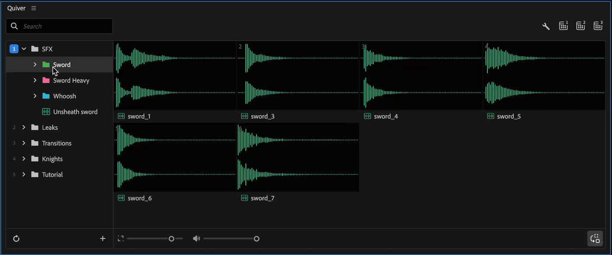
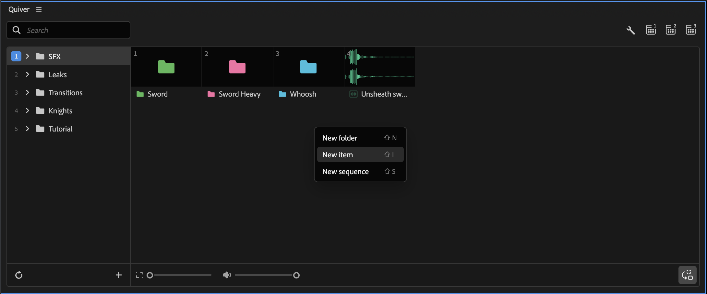
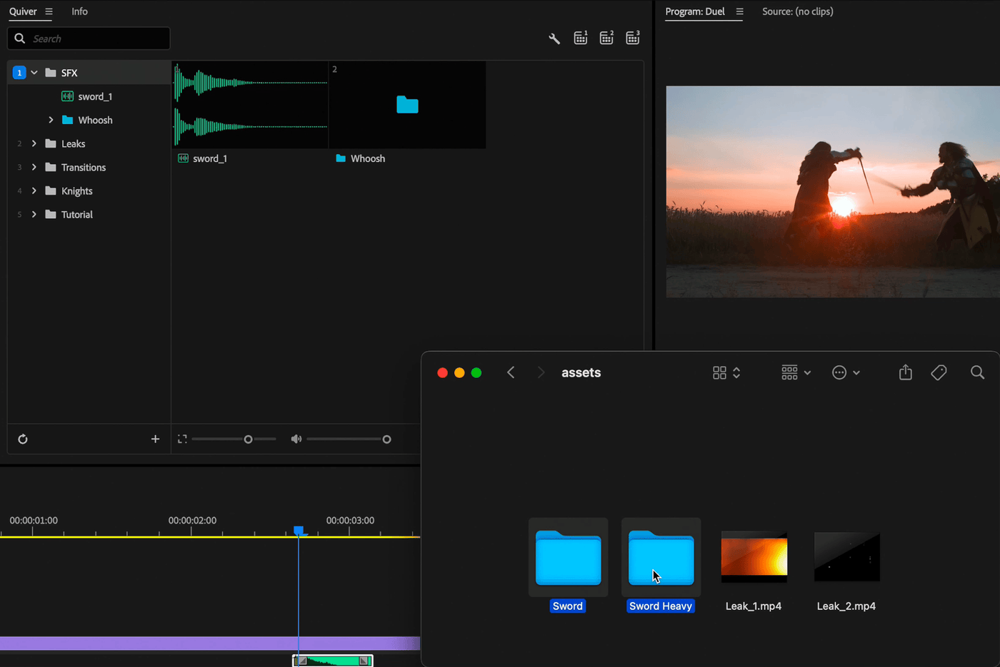
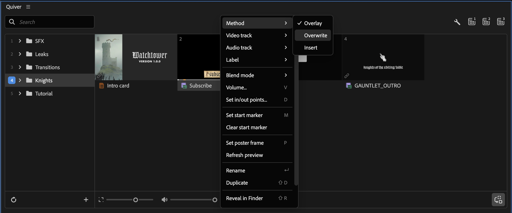
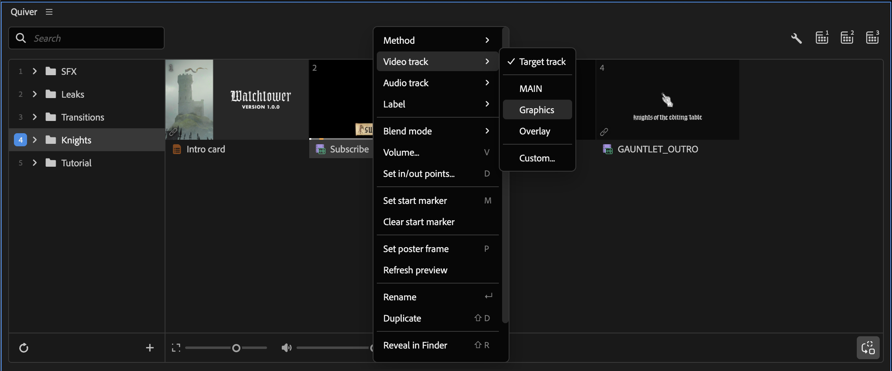
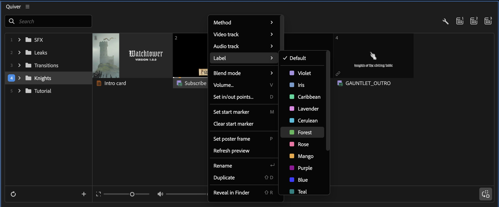
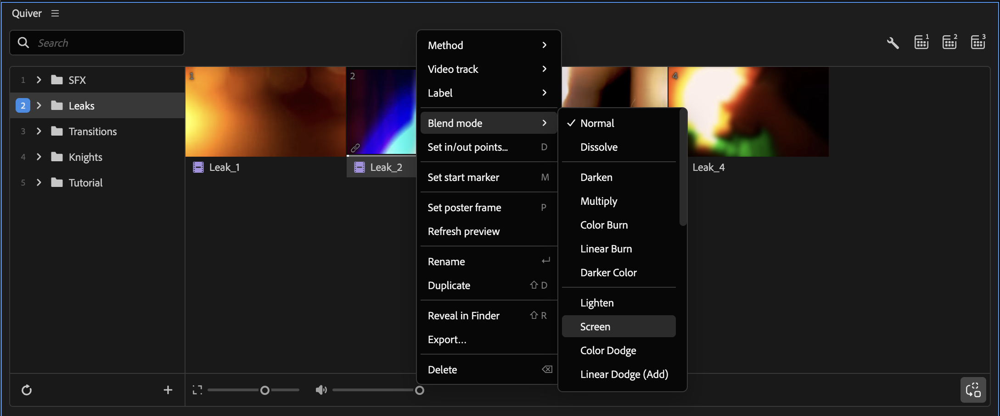
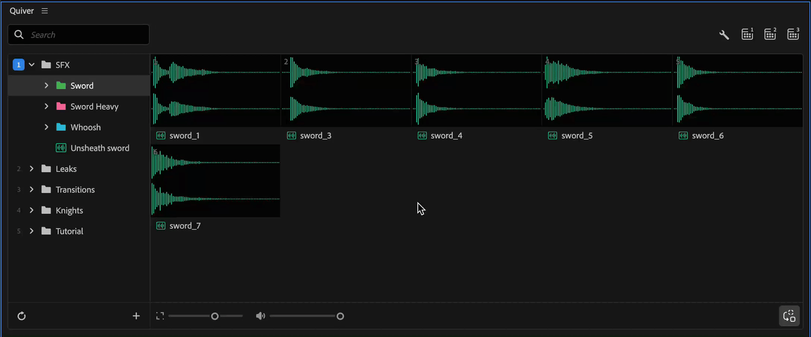
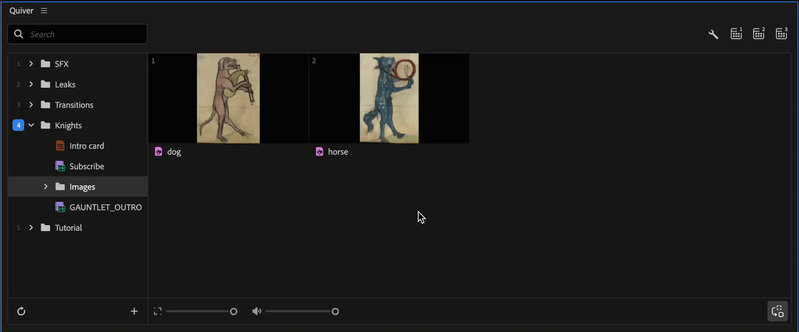
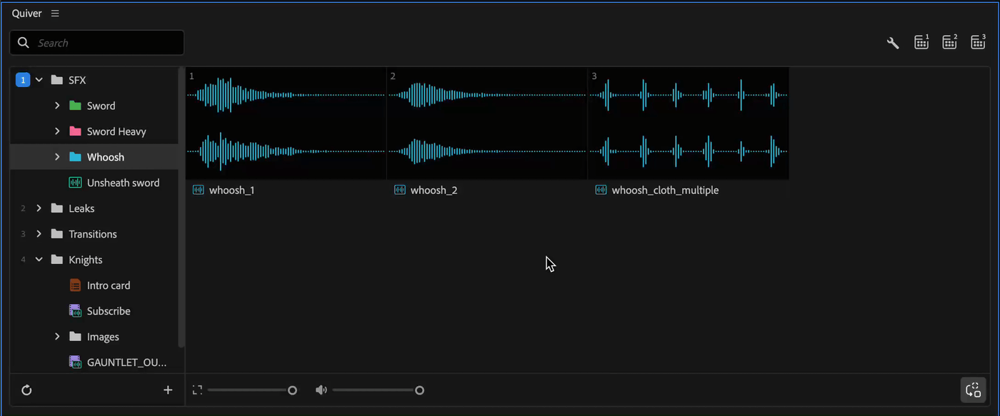

---
layout:
  width: default
  title:
    visible: true
  description:
    visible: false
  tableOfContents:
    visible: true
  outline:
    visible: true
  pagination:
    visible: true
  metadata:
    visible: true
  tags:
    visible: true
  actions:
    visible: true
---

# Main panel

The Quiver main panel is a file manager for clips library. On the left is the folder tree; on the right is the preview pane with item tiles.

## Active Quiver folder

Active Quiver folder has a blue box near it — shortcuts and Toolbar 1 add items from that folder.\
You can activate Quiver folder by clicking on it or with a shortcut.

[Learn more](export-import.md) about Quiver folders.

<figure><figcaption></figcaption></figure>

## Add clips to Quiver

There are multiple ways to add items to Quiver:

* through context menu (right click)

<figure><figcaption></figcaption></figure>

* with **plus button** at the bottom of the panel
* drag and drop from a file manager or from Project panel

<figure><figcaption></figcaption></figure>

Depending on the import mode [setting](settings.md), files will be copied to Quiver data folder or will stay at its original path and referenced in Quiver.


To toggel between import mode, hold `opt/alt` key during drag and drop.


## Add clips to a timeline

It is possible to add Quiver item to a timeline with:

* double click on Quiver item in main panel
* single click on Quiver button in a [toolbar](toolbars.md)
* a shortcut or control surface button assigned to Quiver item in [Spell Book](<../spell-book/README (1).md>)

<figure><figcaption></figcaption></figure>


It is possible to add clips to the timeline during live playback.


***

## Quiver items

### Item types

<figure><figcaption></figcaption></figure>

There are 3 types of buttons in Quiver panel:

<table data-header-hidden><thead><tr><th width="157"></th><th></th></tr></thead><tbody><tr><td><strong>Clip</strong></td><td>Adds one clip associated with a button.</td></tr><tr><td><strong>Folder</strong></td><td>Adds one random clip from a folder. <a href="folder-item.md">Learn more</a>.</td></tr><tr><td><strong>Sequence</strong></td><td>Adds group of clips from a sequence. <a href="sequence-item-group-of-clips.md">Learn more</a>.</td></tr></tbody></table>

### Addition method

To modify add method for clips, right click on it and select a method.

<figure><figcaption></figcaption></figure>

Available methods and their actions are listed below:

<table><thead><tr><th width="155">Method</th><th>Action</th></tr></thead><tbody><tr><td>Overlay</td><td>If targeted track has a clip at playhead, added clip will be added to the first empty track above.</td></tr><tr><td>Overwrite</td><td>Ignores any clip at playhead and overwrites it with a clip.</td></tr><tr><td>Insert*</td><td>Ignores any clip at playhead, inserts a clip and pushes forward all clips on a targeted track.</td></tr></tbody></table>


**\*Insert** method is not available for MOGRT items, due to API limitation.


### Target track

By default clips will be added to the bottom targeted track.

You can change it for each item and specify destination track by its name.

<figure><figcaption></figcaption></figure>

#### Creation of tracks

If a clip targets a track with a name and such track doesn't exist, track will be created.

If a clip uses "**Overlay**" method and a track with name is occupied, new track with incremented name will be created (e.g. "**Sword 2**" is occupied, "**Sword 3**" will be created).

### Label

Change label of an item added to a timeline.

<figure><figcaption></figcaption></figure>

### Blend mode

For video items you can customise blend mode. It is useful for overlays.

<figure><figcaption></figcaption></figure>

### Volume

For audio items set volume when it is added to a timeline.

<figure><figcaption></figcaption></figure>

### Duration

For still images set duration when it is added to a timeline.

<figure><figcaption></figcaption></figure>

### Start Marker

By default clips are added at playhead at their in point.

If a clip has start marker, when added to a timeline, start marker will be aligned with playhead.

<figure><figcaption></figcaption></figure>

If [Auto-mark audio clips](settings.md#auto-mark-audio-clips) is enabled, start marker will be added automatically, when audio clips are added to Quiver, at the loudest part.

### In/Out points

You can set in/out point to a clip, so only part of it will be added to a timeline.

<figure><figcaption></figcaption></figure>
