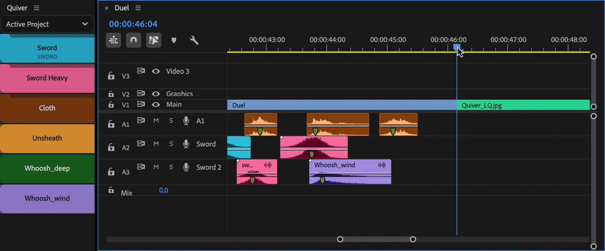

# Main panel

## Add clips to Quiver

To add clips to Quiver, select and drag clips from Project panel onto Quiver panel.

"**Quiver**" bin will be created in the root of Project panel and clips will be moved there.

<figure><figcaption></figcaption></figure>

### Add MOGRTs to Quiver

To add MOGRT files, that don't have project item in Project panel, drag MOGRT file onto Quiver panel from file browser.

Transparent video with name of MOGRT file will be created in "**Quiver**" bin. It is used as placeholder for MOGRT data.

<figure><figcaption></figcaption></figure>


You can change label color of MOGRT item added to a timeline, by changing label color of Transparent video placeholder.


## Add clips to a timeline

To add clips do one of the following:

* Click on Quiver button for added item
* Press a shortcut or control surface button assigned to Quiver item in [Spell Book](<../spell-book/README (1).md>)

<figure><figcaption></figcaption></figure>


It is possible to add clips to the timeline during live playback.


## Activate library project

You can activate Quiver library project via dropdown list or with a shortcut. [Learn more](library-projects.md).

<figure><figcaption></figcaption></figure>

***

## Button types

There are 3 types of buttons in Quiver panel.

<figure><figcaption></figcaption></figure>

#### Clip

Adds one clip assosiated with a button.

#### Bin

Adds one random clip from a bin. [Learn more](bin-item.md).

#### Sequence

Adds group of clips from a sequence. [Learn more](sequence-item-group-of-clips.md).

## Add methods

To modify add method for a clip, right click on it and select a method.

<figure><figcaption></figcaption></figure>

Available methods and their actions are listed below:

<table><thead><tr><th width="155">Method</th><th>Action</th></tr></thead><tbody><tr><td>Overlay</td><td>If targeted track has a clip at playhead, added clip will be added to the first empty track above.</td></tr><tr><td>Overwrite</td><td>Ignores any clip at playhead and overwrites it with a clip.</td></tr><tr><td>Insert*</td><td>Ignores any clip at playhead, inserts a clip and pushes forward all clips on a targeted track.</td></tr></tbody></table>


**\*Insert** method is not available for MOGRT items, due to API limitation.


## Target track

By default clips will be added to the bottom targeted track.

You can change it for each item and specify destination track by its name.


If track name is not listed, create new track in active sequence and name it the way you need.


<figure><figcaption></figcaption></figure>

After track name is selected, it will be shown on an item button.

<figure><figcaption></figcaption></figure>

### Creation of tracks

If a clip targets a track with a name and such track doesn't exist, track will be created.

If a clip uses "**Overlay**" method and a track with name is occupied, new track with incremented name will be created (e.g. "**Sword 2**" is occupied, "**Sword 3**" will be created).
