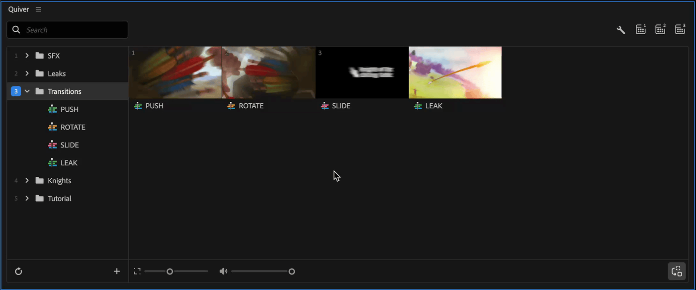
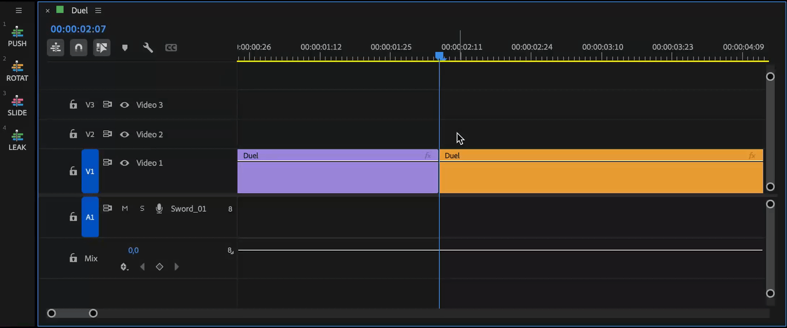

---
layout:
  width: default
  title:
    visible: true
  description:
    visible: false
  tableOfContents:
    visible: true
  outline:
    visible: true
  pagination:
    visible: true
  metadata:
    visible: true
  tags:
    visible: true
  actions:
    visible: true
---

# Sequence item (group of clips)

### Create sequence item

Create a sequence with the context menu (**New sequence**, Shift+S) inside a quiver folder.

<figure><figcaption></figcaption></figure>

You can also import an existing sequence by dragging it from the Project panel onto the Quiver panel.

### Edit a sequence

Each sequence item is a Premiere project. To edit it, right-click and choose **Edit…** or press **Shift+E**.

A new project opens with a timeline where you can add clips. The timeline already contains:

* A **start marker** you can move to control the addition point
* A locked **PREVIEW** track with placeholder clips used to generate preview images


To quickly open and close sequence projects, add a Premiere shortcut to close the active project. Opening and closing a sequence then takes just two shortcuts (Shift+E to edit, then close project).


There is no need to align your clips with the start or end of the placeholder clips — their start point is ignored because the track is locked. Leave a bit of padding at the start and end of placeholders for nicer sequence previews.

### Add to timeline

Clips in a sequence are added via copy-paste. If you want clips grouped on the timeline, group them inside the sequence project itself.

<figure><figcaption></figcaption></figure>

### Sequence defaults

New sequences use **Full HD (1920×1080)** and **25 fps** by default. Change these in [Settings](settings.md).

### Preview placeholders

Placeholder images for sequence previews can be customized in Settings. After changing placeholders, right-click a sequence and choose **Generate preview** or **Refresh preview**.

### Copy media to Quiver folder

For portable sequence items, right-click a sequence and choose **Copy media to Quiver folder**. This copies sequence media into the Quiver data folder so the item works when exported or moved.

### Addition options

Right-click a sequence item to adjust addition settings such as method, target track, and label.\
See [Quiver items](main-panel.md#quiver-items).

The **Add as individual clips** toggle is enabled by default — clips are added as individual clips via copy/paste.
