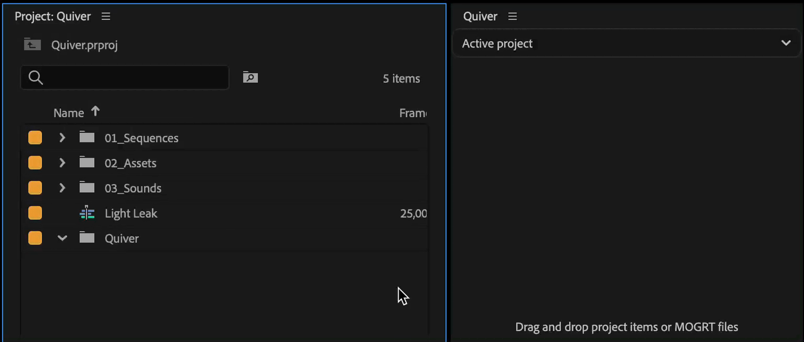

# Sequence item (group of clips)

## Create sequence item

To create sequence item, drag and drop a sequence onto Quiver panel.

<figure><figcaption></figcaption></figure>

## Addition Options

To customise addition options, right click on sequence button.

<figure><figcaption></figcaption></figure>

### Add as individual clips

When adding sequence item to a timeline, clips from the sequence will be added as individual clips.

This is useful for creating custom transtions with effects and sounds.

<figure><figcaption></figcaption></figure>

Any effect applied to clips inside sequence **will be transferred**, so you can use blend modes, effects and keyframes.


Limitations: non-linear keyframes and masks are not supported.

To overcome it, use [un-nest method](sequence-item-group-of-clips.md#un-nest-sequence-copy-paste) below.


### Un-nest sequence (copy/paste)

With un-nest option enabled, Quiver will briefly activate source sequence, copy clips from it and paste them to a current timeline.

<figure><figcaption></figcaption></figure>

Any effect or transition applied to clips inside sequence **will be transferred**, so you can use blend modes, effects and keyframes. No limitations.

### Group clips

After individual clips are added to a timeline, they will be grouped, so it is easier to move them together.
