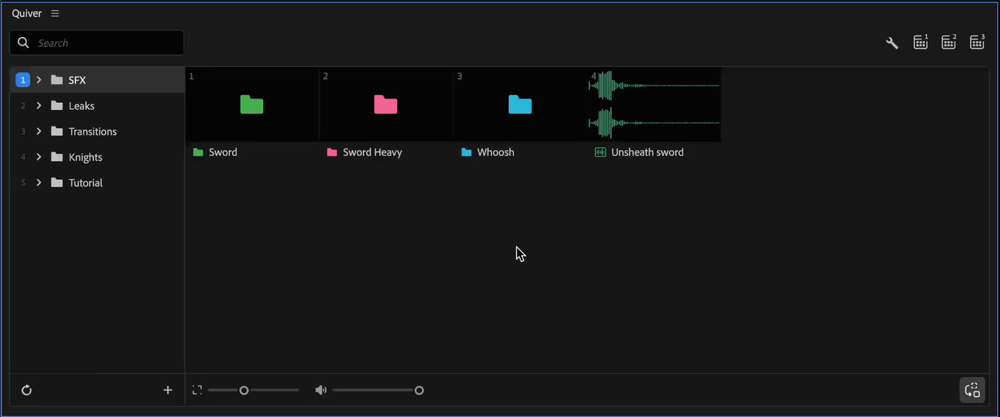

---
layout:
  width: default
  title:
    visible: true
  description:
    visible: false
  tableOfContents:
    visible: true
  outline:
    visible: true
  pagination:
    visible: true
  metadata:
    visible: true
  tags:
    visible: true
  actions:
    visible: true
---

# Settings

Open settings with **Open settings** button in Quiver main panel.

<figure><figcaption></figcaption></figure>

## General

### Auto-mark audio clips

When adding audio clips to Quiver, Quiver will analyse audio clips and add start markers at the loudest part of the clip.

This is useful for audio clips like whooshes, hits, etc.

### Replace selected clips

If enabled, Quiver will replace selected clips with Quiver item, keeping start points in sync.

If selected items have start markers, new items will be aligned with them.

See Main panel for details and audition workflow.

### Add metadata to clip name

When enabled, Quiver adds metadata to the clip name for copy-pasted clips. This is needed for the **Replace selected clips** feature to work correctly with sequence items.

### Import mode

Choose how media is handled when you add items:

* **Copy files to Quiver data** — media is copied into the Quiver data folder (default)
* **Reference files (no copy)** — Quiver uses the original file path; a link icon appears on the tile

Hold `opt/alt` while dragging to switch import mode for a single drop.

### Quiver data path

Change where Quiver stores folders and media. Useful for cloud-synced storage shared across machines.

### Spell Book items amount

Set amount of Quiver items to be shown in Spell Book.

## Toolbar

Configure toolbar count and appearance.

* **Toolbars quantity** — 1, 2, or 3 toolbars
* **Toolbars style** — Default or Color

See Toolbars for usage details.

## Sequence

Default settings for newly created sequence items.

* **Sequence width** and **Sequence height** — default resolution (1920×1080)
* **Frame rate** — default fps (25)

## Preview

Images used for sequence item preview generation.

* **Placeholder A** and **Placeholder B** — custom images for preview placeholders
* **Disable placeholder images** — use solid placeholders instead
* **Restore defaults** — reset placeholder images to defaults
