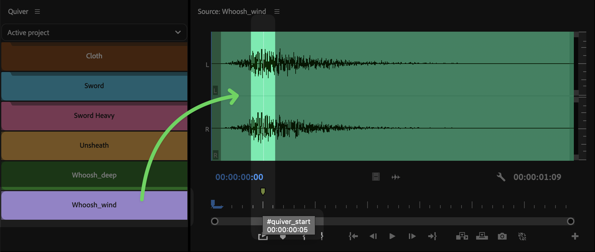
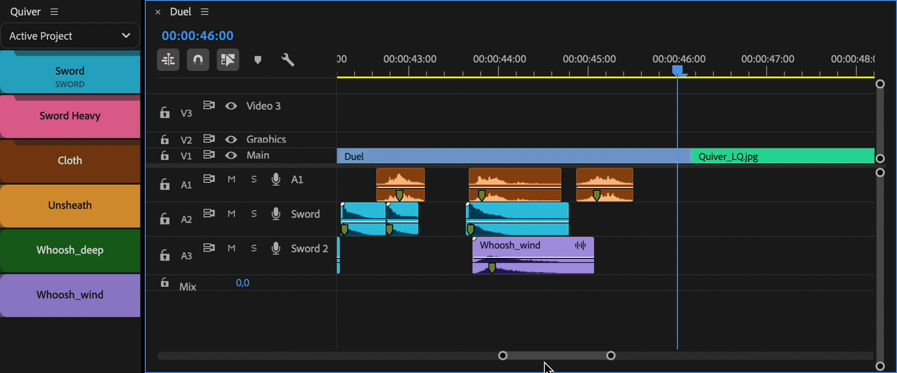

# Settings

To access settings сlick on hamburger menu or right click on Quiver panel

<figure><figcaption></figcaption></figure>

## Auto-mark audio clips

When adding audio clips to Quiver panel, Quiver will analyse audio clips and add start markers at the loudest part of the clip.

This is useful for audio clips like whooshes, hits, etc.

<figure><figcaption></figcaption></figure>

## Replace selected clips

If enabled, Quiver will replace selected clips with Quiver item, keeping start points in sync.

If selected items have start markers, new items will be aligned with them.

<figure><figcaption></figcaption></figure>

After replacing selected clip, new clip will stay selected, so you can quickly replace it again.


If "Replace selected clips" is enabled, when adding clips to a timeline they will stay deselected (so next added clip won't replace previous one).

To keep clip selected after it is added to a timeline (useful for creating Excalibur user commands), disable "Replace" feature.


### Replace audition

Use Bin button, loop playback and "Replace selected clips" feature to quickly audition clips and replace them until you find the perfect one.

<figure><figcaption></figcaption></figure>

## Spell Book items amount

Set amount of Quiver items to be shown in Spell Book.


Currently maximum amount is set to 100 items.

Such limit is set, because more items can break Spell Book connection.

