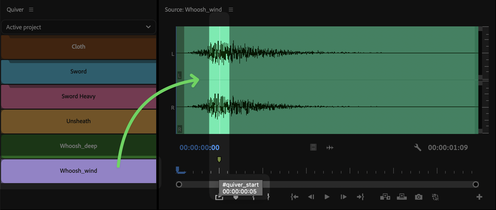
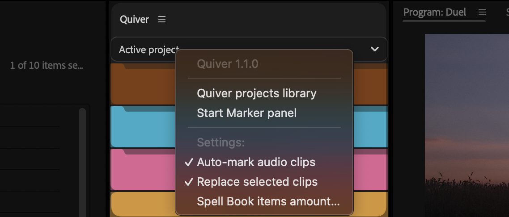
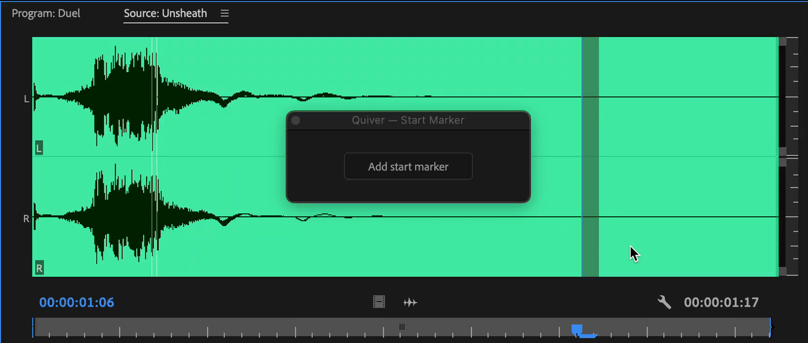

# Start Marker

By default clips are added at playhead at their in point.

If a clip has start marker, when added to a timeline, start marker will be aligned with playhead.

<figure><figcaption></figcaption></figure>

## Open Start Marker panel

To access Start Marker panel, click on hamburger menu or right click on Quiver panel.

<figure><figcaption></figcaption></figure>

## Add start marker

If [Auto-mark audio clips](settings.md#auto-mark-audio-clips) is enabled, start marker will be added automatically, when audio clips are added to Quiver, at the loudest part.

To add start marker manually:

* Open Start marker panel
* Open clip in Source Monitor
* Move playhead
* Press "Add start marker"

Start marker will be added at the playhead position.

<figure><figcaption></figcaption></figure>

When adding start marker to a sequence item in Quiver, you can just activate sequence itself (without Source monitor) and add start marker there.


To add start marker without opening panel use [Spell Book shortcut](spell-book-shortcuts.md).

