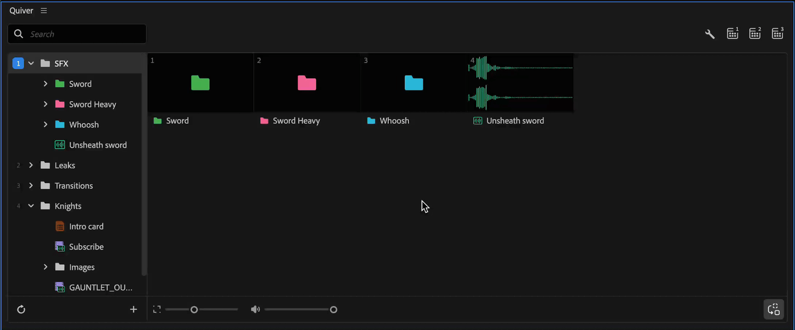
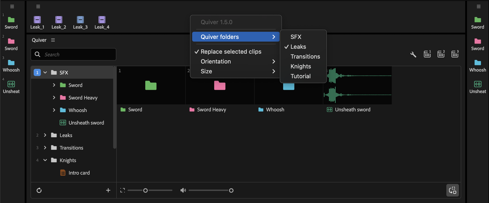
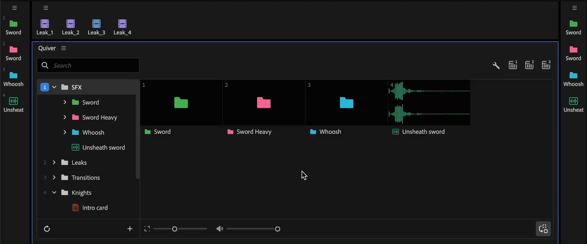
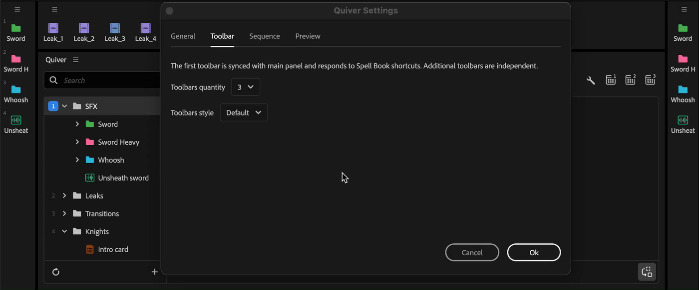

---
layout:
  width: default
  title:
    visible: true
  description:
    visible: false
  tableOfContents:
    visible: true
  outline:
    visible: true
  pagination:
    visible: true
  metadata:
    visible: true
  tags:
    visible: true
  actions:
    visible: true
---

# Toolbars

In addition to the main panel, you can open up to three toolbars for one-click item insertion.

Open toolbars from the buttons in the main panel header, or with Spell Book commands.

<figure><figcaption></figcaption></figure>

### Toolbar 1 (synced)

The first toolbar syncs with the Quiver main panel. It shows items from the active folder, and Spell Book **Add Quiver item** shortcuts add items shown in this toolbar.

### Toolbars 2 and 3 (independent)

Additional toolbars are independent. Pick a quiver folder and keep it active in that toolbar, regardless of what the main panel shows.

<figure><figcaption></figcaption></figure>

### Navigation

* **Click** an item to add it to the timeline
* **Click** a folder to add a random item from inside it
* **Cmd/Ctrl + click** a folder to open it
* Use the **Go back** button to return to the parent folder

### Layout and size

Right-click on the toolbar to change layout and tile size.

Layouts available: **Grid**, **Horizontal**, **Vertical**.

Tile size can be **Small**, **Medium**, or **Large**.

<figure><figcaption></figcaption></figure>

### Toolbar style

In [Settings](settings.md), choose the toolbar appearance:

* **Default** — standard toolbar look
* **Color** — colored toolbar buttons

<figure><figcaption></figcaption></figure>

Configure how many toolbars are available in Settings (1, 2, or 3).

