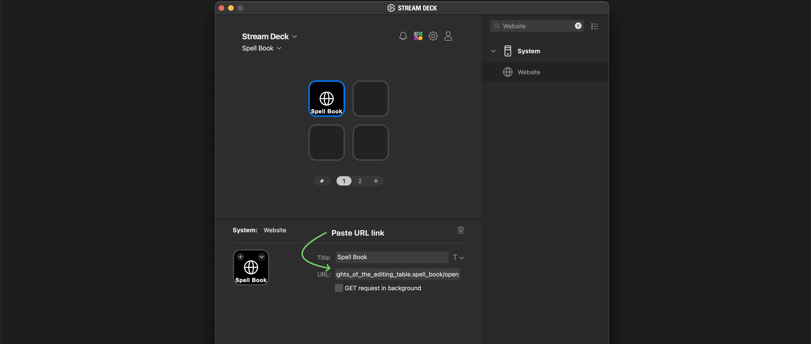

---
layout:
  title:
    visible: true
  description:
    visible: false
  tableOfContents:
    visible: true
  outline:
    visible: true
  pagination:
    visible: true
---

# Control Surfaces

Besides shortcut press, Spell Book listens for URL links to trigger extension commands.

This allows to use any Control Surface that supports URL calls with Spell Book:\
Stream Deck, TouchPortal, etc.

### Copy URL link

To copy URL link for a specific command, open Spell Book and hover your mouse over a command.

Link icon will appear, click on it to copy it.

<figure><figcaption></figcaption></figure>

***

## Examples

Examples how to setup control surface to work with Spell Book commands.

### Stream Deck

* find **Website** option

<figure><figcaption></figcaption></figure>

* Drag it over a button and paste URL link (don't use GET request)

<figure><figcaption></figcaption></figure>

### TouchPortal

* find **Open URL** command

<figure><figcaption></figcaption></figure>

* Drag it to "On Pressed" and paste URL link

<figure><figcaption></figcaption></figure>


Need more examples? Write me to support@knightsoftheeditingtable.com

