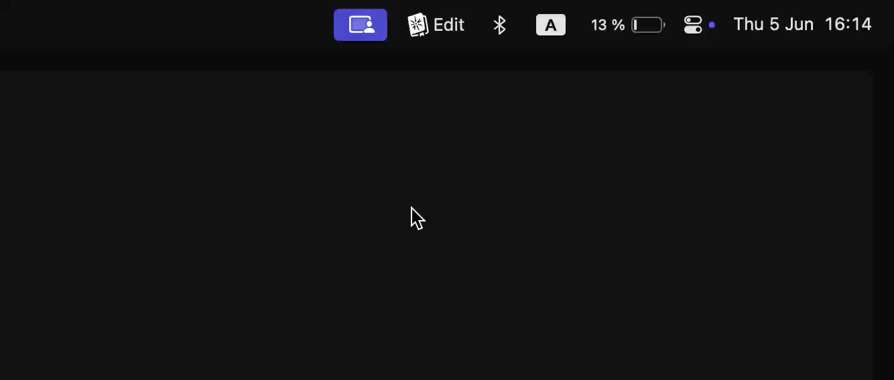
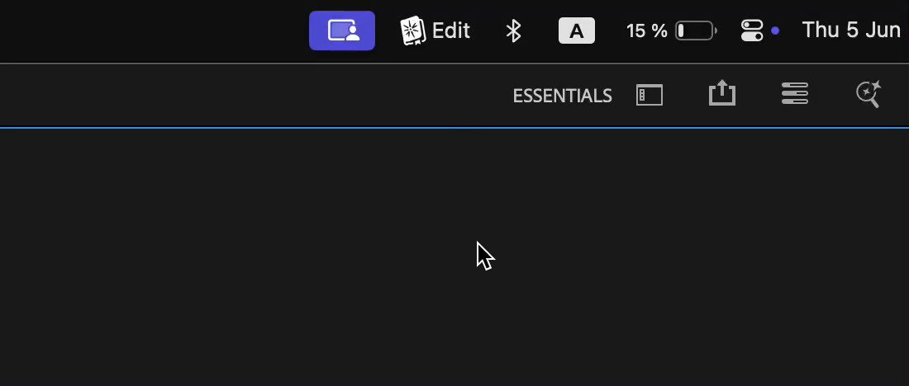

# Main window

<figure><figcaption></figcaption></figure>

## Show Spell Book

To open Spell Book window use one of these methods

* Assign shortcut to "Open Spell Book" in Spell Book
* In Adobe app, go to `Window -> Extensions -> Spell Book`&#x20;

<figure><figcaption></figcaption></figure>

* In OS tray bar, find Spell Book icon, click on it and click on "Show Spell Book"

<figure><figcaption></figcaption></figure>

## Profile

Profile allows to save different shortcuts layout. Depending on your current workflow, you can quickly switch between different modes and use same shortcuts for different commands.

To switch between profiles you can:

* Assign shortcut to "Toggle Profile" in Spell Book
* Open Spell Book and change profile

<figure><figcaption></figcaption></figure>

* Click on Spell Book icon in tray bar and change profile

<figure><figcaption></figcaption></figure>

#### Save as

To create new profile, use "Save as..." button.

#### Import/Export profiles

To transfer your profiles to another machine, use Import/Export buttons.

It is possible to transfer profiles between macOS and Windows.\
Table below, shows how modifier keys will me transformed for each operating system.

| macOS   | Windows     |
| ------- | ----------- |
| Shift   | Shift       |
| Control | Ctrl        |
| Option  | Alt         |
| Command | Windows key |

