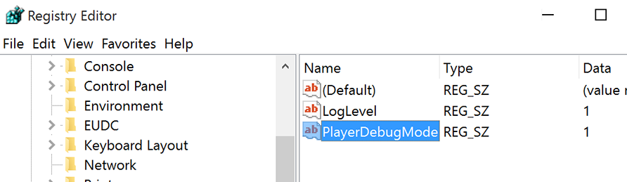

# Customize sounds

It is possible to replace sounds with your own version, but <mark style="background-color:orange;">it will break</mark> extension signature.\
If signature is broken it is impossible to open extension, unless <mark style="background-color:green;">debug mode is enabled</mark>.

Therefore this instruction consists of two parts:

1. [Enabling debug mode](customize-sounds.md#enabling-debug-mode)
2. [Replacing sounds](customize-sounds.md#replacing-sounds)

## Enabling debug mode



Open regedit > HKEY\_CURRENT\_USER/Software/Adobe/CSXS.11, then add a new entry **`PlayerDebugMode`** of type **`string`** with the value of **`1`**.

<figure><figcaption><p><em>On Windows, Regedit is located in (C:\Windows\regedit). You also can access it using CMD.</em></p></figcaption></figure>



In the **terminal**, type:

```
defaults write com.adobe.CSXS.11 PlayerDebugMode 1
```



Number after CSXS depends on Premiere Pro version.\
Here is the list of Premiere Pro/CSXS matching versions:

| Premiere Pro           | CSXS    |
| ---------------------- | ------- |
| Premiere Pro 14.0-14.3 | CSXS.9  |
| Premiere Pro 14.4-15.3 | CSXS.10 |
| Premiere Pro 15.4+     | CSXS.11 |

## Replacing sounds

To change default sounds, just replace files in `audio` folder:

#### Windows

```
C:\Users\*username*\AppData\Roaming\Adobe\CEP\extensions\knights_of_the_editing_table.thegame\assets\audio
```

#### macOS:

```
/Library/Application Support/Adobe/CEP/extensions/knights_of_the_editing_table.thegame/assets/audio
```

Here is the list of menu sounds matching events:

| Menu event                      | Sound file name        |
| ------------------------------- | ---------------------- |
| Background music, with ambience | music.mp3              |
| Button click                    | UI\_button.mp3         |
| Single player submenu open      | UI\_horse.mp3          |
| Multi player submenu open       | UI\_multiplayer.mp3    |
| Submenu open                    | UI\_scroll.mp3         |
| Armoury welcome speech          | merchant\_\[1-3].mp3   |
| Armoury ambience                | merchant\_bg.mp3       |
| Start of a game                 | chronicler\_\[1-3].mp3 |


If file name has number in brackets, e.g. \[1-3], it means there are multiple version of this file. You can not add more files than already exists, additional files will be ignored.


List of sounds matching Premiere Pro events (files are inside `audio/game` folder):

| Premiere Pro event            | Sound file name                   |
| ----------------------------- | --------------------------------- |
| Project panel activated       | game\_project\_1.mp3              |
| Sequence activated            | game\_sequence\_1.mp3             |
| Sequence clip selected        | game\_select\_\[1-8].mp3          |
| Sequence clip moved           | game\_move\_\[1-8].mp3            |
| Sequence clip added           | game\_add\_\[1-3].mp3             |
| Sequence clip removed         | game\_remove\_\[1-5].mp3          |
| Sequence tracks added/removed | game\_sequenceStruct\_1.mp3       |
| Background music              | game\_music\_\[1-14].mp3          |
| Media Encoder launch          | game\_encoderStart\_\[1-2].mp3    |
| Media Encoder 75% progress    | game\_encoderProgress\_\[1-2].mp3 |
| Media Encoder abort/error     | game\_encoderAbort\_\[1-3].mp3    |
| Media Encoder finish          | game\_encoderFinish\_\[1-3].mp3   |
