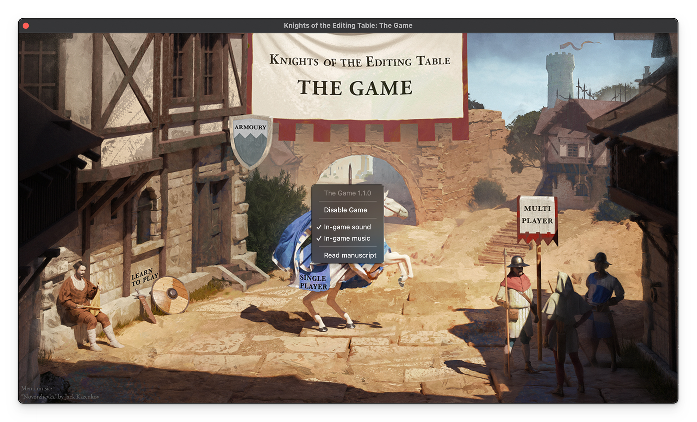

# Settings

You can access settings with right click on Game menu screen.

<figure><figcaption></figcaption></figure>

## Disable/Enable Game

Will disable loading screen, all music and sounds inside Premiere Pro.


It is not possible with API to disable completly The Game extension. During loading of Premiere Pro you will see quick open and close of The Game menu window. However, there will be no image, nor sound.


## In-game sound

Enable or disable in-game sounds: select clips, switch sequence, render media, etc.

## In-game music

Enable or disable in-game music.
