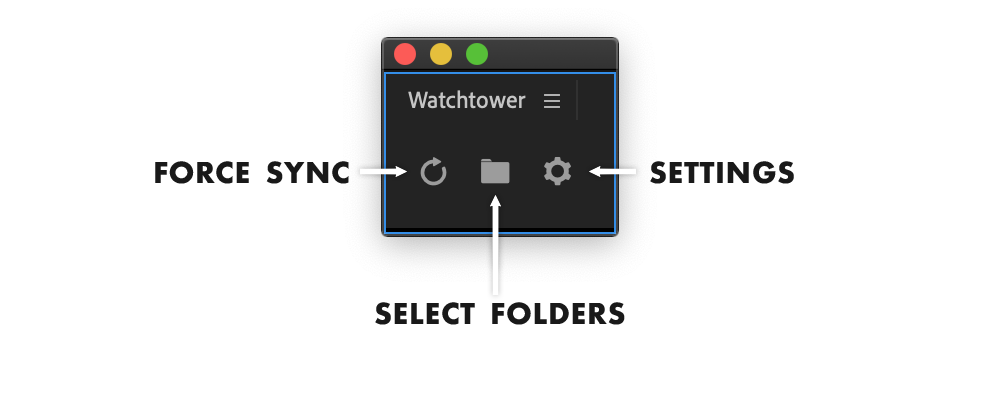

# Main Panel

Watchtower main panel has 3 buttons. It is possible to align them vertically in settings.

## Force Sync

Click it whenever you need to sync folders.  
If you turned on auto sync, you can forget about it :\)

## Select Folders

Opens a menu where you can add/remove watch folders from your project. Also you can adjust if folders should use image sequence import, be flattened or use relative path.

#### Sync folder to an existing bin

Select one bin in your project, **alt+click** on select folders button and you will be able to link folder to that bin.

## Settings

In settings you can adjust import options, filter for file extensions and folder names, deactivate license on current machine and download update.


If you already selected watch folders for your project and turned auto sync on, you can close main panel and Watchtower will continue to work in background


