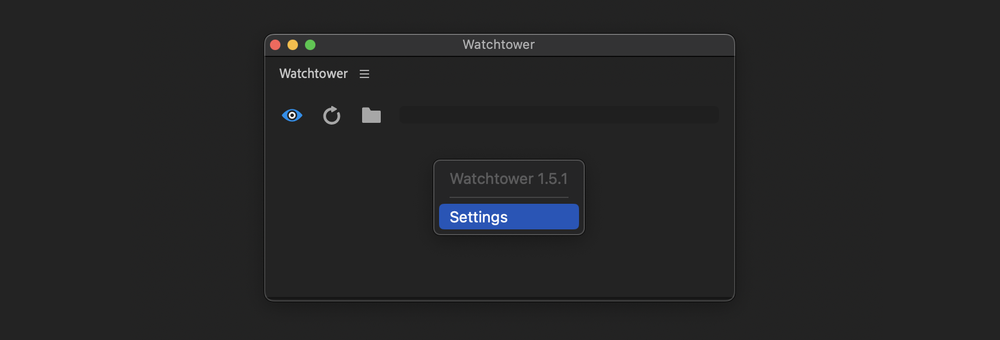

# Main Panel

Watchtower main panel has 3 buttons:

* **Watch/Un-watch —** toggle auto-sync
* **Sync —** to manually sync folders
* **Folders —** open watch-folders manager where you can add/remove watch folders and adjust watch-folders settings


If you already selected watch folders for your project and turned auto sync on, you can close main panel and Watchtower will continue to work in background


***

## Settings

To access settings, right-click on the main panel or click on 3 lines (flyout menu).

<figure><figcaption></figcaption></figure>

***

## Add watch-folders

Select folders in your file browser and drag'n'drop them on Watchtower panel.

<figure><figcaption></figcaption></figure>

## Link existing bins

Select one or more bins in your project and drag'n'drop them on Watchtower panel.

<figure><figcaption></figcaption></figure>


Watchtower will offer folder path based on files path inside a bin.\
You can change folder path if it is not correct.

