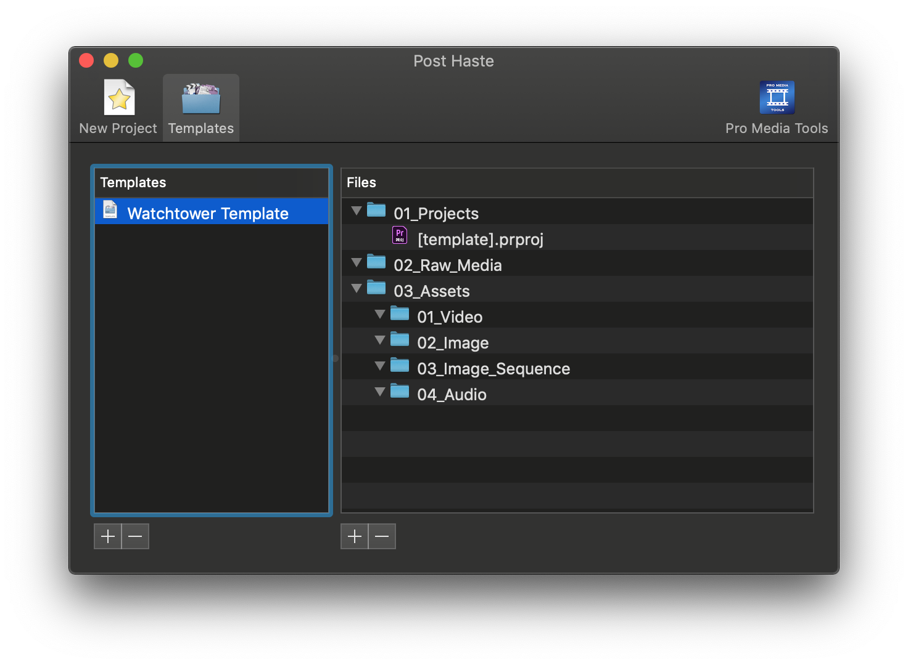

# Watchtower + Post Haste

[Post Haste](https://www.digitalrebellion.com/posthaste/) is a free project management tool that allows you to setup file and folder templates for your projects.

When using Watchtower with Post Haste you will be able to setup a project template that will have auto sync feature without need to open Watchtower panel.

## Setting up template project




1. Open Post Haste and navigate to your template.
2. Right click on template top folder and select "Reveal in Finder/Explorer".
3. Copy "Files" folder with template folder structure and paste it to temporary location \(e.g. "Desktop"\).
4. Open template project and then Watchtower Select Folders. In Standard select folders from template folder structure.
5. In Advanced set all folders to **relative path** \("R" checkbox\). Adjust other settings if needed.
6. Selected folders will be added to project.
7. Save modified template project and copy it.
8. Replace original template project with modified one.




* Open Post Haste and navigate to your template

* Right click on template top folder and select "Reveal in Finder/Explorer"

* Copy "Files" folder with template folder structure and paste it to temporary location \(e.g. "Desktop"\).

* Open template project and then Watchtower Select Folders. In Standard select folders from template folder structure.

* In Advanced set all folders to **relative path** \("R" checkbox\). Adjust other settings if needed.

* Selected folders will be added to project.

* Save modified template project and copy it.

* Replace original template project with modified one.





After setting up template project Watchtower panel could be closed, auto sync will work in background



If you want to sync folder out of template folder structure use absolute path. \(e.g. "Music Libary", "Downloads"\)


